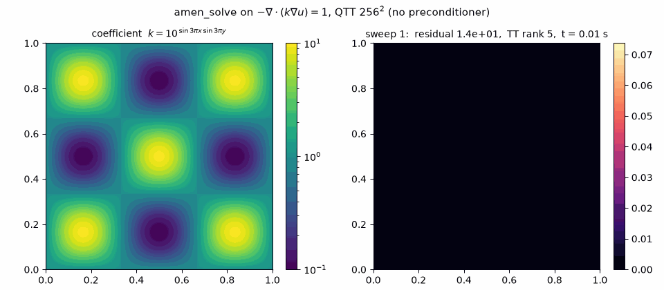

# ttpy 2

The Tensor Train toolbox, rewritten in pure Python.

Not on PyPI yet (the `ttpy` name there is still the 1.x Fortran package);
install straight from this branch -- pure Python, no compiler needed:

```bash
pip install "ttpy[fast] @ git+https://github.com/oseledets/ttpy@ttpy2"
```

or, for development:

```bash
git clone -b ttpy2 https://github.com/oseledets/ttpy && cd ttpy
pip install -e ".[fast,test]"
pytest -q          # ~1000 tests, a couple of minutes
```

The `[fast]` extra ships numba-compiled sweeps for the KSL integrator
(5-10x), the greedy-cross bond kernel and the AMEn local solvers; numba
installs from wheels, so no compiler is needed either way.  Without it
every result is identical, just slower (`tests/test_fast.py` pins the
parity).

No Fortran, no `f2py`, no compiler, no git submodules: the package is pure
Python and installs from the repository in seconds.

```python
import numpy as np
import tt

bits = 8                                   # a 256 x 256 grid as 16 QTT modes
h = 1.0 / (2**bits + 1)
one = tt.ones(2, bits)
x = (tt.xfun(2, bits) + one) * h           # grid points as a QTT vector

def k(v):                                  # smooth coefficient, contrast 100
    return 10.0 ** (np.sin(3*np.pi*v[:, 0]) * np.sin(3*np.pi*v[:, 1]))

# k sampled at the flux faces by TT-cross -- no dense array is ever formed
kx = tt.multifuncrs([tt.kron(x - one*(h/2), one), tt.kron(one, x)], k, 1e-10, verb=0)
ky = tt.multifuncrs([tt.kron(x, one), tt.kron(one, x - one*(h/2))], k, 1e-10, verb=0)

D = (tt.eye(2, bits) - tt.qshift(bits)) * (1.0/h)
Dx, Dy = tt.kron(D, tt.eye(2, bits)), tt.kron(tt.eye(2, bits), D)
A = (Dx.T @ tt.diag(kx) @ Dx + Dy.T @ tt.diag(ky) @ Dy).round(1e-12)

f = tt.ones(2, 2*bits)
u = tt.amen_solve(A, f, f, 1e-8, verb=0)   # no preconditioner
print((tt.matvec(A, u) - f).norm() / f.norm())
```

A variable-coefficient diffusion $-\nabla\cdot(k\nabla u)=1$, assembled and
solved entirely in the compressed format: the coefficient enters through
TT-cross interpolation from pointwise samples, the operator is a sum of
Kronecker products, and `amen_solve` needs eight sweeps:



The animation is the solver iterate after every sweep
(`examples/qtt_divgrad_cross.py --gif`, which also checks the assembly
against a `scipy.sparse` oracle).  A picture gallery of all the examples --
quantum dynamics at paper scale, polymer rheology, epidemics on networks,
robust completion -- is in [examples/README.md](examples/README.md).  The plain Laplacian at any dimension is
one call: `tt.qlaplace_dd([12, 12, 12])` is $2^{12}$ points per axis --
6.9e10 unknowns.

For a prescribed TT-rank profile, ``lobpcg_solve`` keeps every rank fixed and
recycles one transported PCG direction per core instead of enriching the TT
bases:

```python
depth = 12
profile = [min(4, 2 ** min(k, depth-k)) for k in range(depth+1)]
x0 = tt.rand(2, depth, profile)
x, info = tt.lobpcg_solve(
    A, b, x0, 1e-8, local_steps=12, verb=0, return_info=True
)
print(info.projected_gradient, x.r)
```

It minimizes the SPD energy on the fixed-rank manifold.  Thus its stopping
quantity is ``||P_T(Ax-b)||/||b||``; use ``check_true_res=True`` when the full
linear residual is also required.  A manufactured two-dimensional QTT example
with both checks is in ``examples/lobpcg_fixed_rank.py``; the algorithm and a
constrained-rank example are documented in ``docs/LOBPCG.md``.

An ordinary conservative central-difference discretization of
``-div(k grad u)`` can be assembled directly in QTT from a vectorized
coefficient function:

```python
import numpy as np
import tt

def k(points):
    x, y = points[:, 0], points[:, 1]
    return 1.0 + 0.5*np.sin(2*np.pi*x)*np.sin(2*np.pi*y)

A = tt.qtt_divgrad([8, 8], k)
f = tt.ones(2, 16)
x = tt.amen_solve(A, f, None, 1e-8, verb=0)
```

It samples ``k`` at faces by TT-cross and assembles
``D.T @ diag(k_face) @ D`` with homogeneous Dirichlet boundaries.  This is
independent of the [Kazeev--Bachmayr](https://doi.org/10.1007/s10208-020-09446-z) multilevel operator; see
``docs/QTT_FD.md`` and ``examples/qtt_divgrad_solvers.py``.

## What it is

A tensor in the TT (tensor train) format is stored as `d` cores of shape
$(r_i, n_i, r_{i+1})$, which turns $\prod_i n_i$ numbers into
$\sum_i r_i n_i r_{i+1}$ and makes linear algebra in dimension 100 possible.
What is implemented, against the 1.x baseline:

| | ttpy 1.x | ttpy 2 |
|---|---|---|
| TT algebra, rounding, TT-SVD | Fortran core | pure numpy/torch, same numbers |
| cross approximation | `rect_cross` | `rect_cross` + Savostyanov's greedy `dmrg_cross` |
| linear solvers | `amen_solve` | `amen_solve` (2.8x faster) + spectral-in-time `tamen` with exact invariants |
| eigensolvers | `eigb` | `eigb`, dense or matrix-free local solves |
| dynamics | `ksl` | `ksl` with compiled float64/complex128 sweeps + step-adaptive `ksl_adaptive` |
| Riemannian toolbox | — | tangent-space machinery + `rgd` with torch autodiff |
| elliptic QTT | — | BPX multilevel preconditioner (`tt.algs.qtt_ell`) |
| sampling / densities | — | `tt.transport`: Sample-DIRT densities and Rosenblatt transports |
| backends | numpy | numpy and torch, CPU/CUDA/MPS |
| install | f2py + Fortran toolchain | pure-python wheel |

The reusable sample-only density and inverse Rosenblatt transport kernel lives
in `tt.transport`.  It includes TT density families, exact contractions,
fitters, transport composition, refinement, and serialization, but deliberately
ships no experiment gallery or generated results.  Those research artifacts
live in the separate [`sample-dirt`](https://github.com/oseledets/sample-dirt)
project, which uses `ttpy2` as its library dependency.

## Backends

The numerics run on numpy by default and on torch (CPU or GPU) on request:

```python
tt.set_backend("torch", device="cuda", dtype="float64")
```

Both produce the same numbers, including the same truncation ranks; that is a
test, not a hope (`tests/test_backend_torch.py`).

Which one is faster depends on the operation, and not in the direction you might
expect — see [docs/PERFORMANCE.md](docs/PERFORMANCE.md). Short version: TT
rounding is a chain of many *small* sequential factorizations, so it is bound by
LAPACK call latency, not by FLOPs. A GPU does not help there, and neither do 64
BLAS threads (they hurt). Contractions such as `dot` are GEMM-bound and the GPU
wins by an order of magnitude. For large ranks use the randomized rounding, which
turns the SVD chain into matrix multiplications:

```python
y = x.round(rmax=100, method="randomized")
```

## Elliptic problems in QTT

The condition number of a QTT-discretized elliptic operator grows like $4^d$, so
an unpreconditioned iteration stops working long before the format does.
`tt.algs.qtt_ell` implements the multilevel preconditioner of [Bachmayr and
Kazeev (FoCM 20, 2020)](https://doi.org/10.1007/s10208-020-09446-z) with the ranks their theory predicts: $2^{2D+1}$ for the
preconditioner and $2^{2D} + 2^{2D-1}$ for the fused factors, both independent
of the number of levels.

```python
from tt.algs.qtt_ell import bpx, bpx_theta

C = bpx(d, D=1)                       # the preconditioner, TT rank 8
theta, = bpx_theta(d, D=1)            # the fused factor: B = theta^T theta
```

$-u'' = 1$ with $u(0) = 0$, $u'(1) = 0$, AMEn at `eps = 1e-10`, `d = 30`
($2^{30}$ unknowns), one host, interleaved runs:

| | sweeps | time | relative error |
|---|---|---|---|
| unpreconditioned | 30 | 18.4 s | **1.01** (i.e. wrong) |
| with BPX | 8 | 0.27 s | 1.9e-13 |

The catch worth knowing before you use it: the preconditioned operator must
never be *assembled* as $CAC$. Its entries cancel over $4^d$, so rounding that
product loses accuracy like $4^d \varepsilon$ -- 6.0e-04 at `d = 20`, 4.8e+14 at
`d = 50` -- and its rank grows with $d$. `bpx_theta` gives the fused factors
instead, and $B = \sum_k \theta_k^T \theta_k$ is the same matrix at rank 17, flat
in `d`. Run `examples/bpx_elliptic.py` for the whole story.

## Coming from ttpy 1.x

Your `import tt` scripts should keep working. Read
[docs/COMPAT.md](docs/COMPAT.md) for the exceptions — in particular three places
where the old package was quietly returning a transposed or wrong result, now
fixed and checked against dense ground truth.

## Development

```bash
uv venv && uv pip install -e ".[test]"
pytest -q                       # core + backend + algorithms
python bench/bench_core.py --backends numpy torch --out bench/results/core.json
```

Requirements live in [docs/REQUIREMENTS.md](docs/REQUIREMENTS.md) and are the
source of truth: the code should be reproducible from them and the tests. The
measured limits behind the defaults — accuracy floors, what each knob is worth
in which regime, what a float32 or MPS backend can and cannot do — are in
[docs/NUMERICS.md](docs/NUMERICS.md), which the docstrings point at rather than
carry themselves.

## Where it stands

888 tests, all against dense ground truth or a mathematical invariant — never
against the old implementation. Measured against the Fortran ttpy on one host
(details and raw data in [docs/PERFORMANCE.md](docs/PERFORMANCE.md)): faster on
rounding (1.2-1.5x), on `dot` (2x), on `tt_svd` (11.9x) and on `amen_solve`
(2.8x, and 60x more accurate on the same problem).  The KSL integrator, once
9x slower, now runs its sweeps as compiled numba kernels (float64 and
complex128) and is within ~2-3x of the Fortran on the reference problem --
measured on contended machines, so read `docs/PERFORMANCE.md` 3b before
quoting the number.

Testing against dense truth also turned up four defects in the old package
(transposed `Toeplitz` and `qshift`, a plainly wrong `IpaS`, a broken K/S order
in the real branch of the KSL integrator) and several in this one, all fixed and
documented in [docs/COMPAT.md](docs/COMPAT.md). Four of them were *silent wrong
answers* -- a returned number with nothing to say it was meaningless -- and that
is the failure mode this package tries hardest to make impossible.

### Future plans

The next planned pieces of work live in [docs/plans/](docs/plans/), each with
a written design and the measurements behind it: the rank-adaptive BUG
integrator (which would lift the fixed-rank restriction of KSL), a block AMEn
eigensolver, the second-order half of the Riemannian toolbox (geomCG, trust
region, rank adaptation), the coefficient-dependent BPX factors, and a
compiled Krylov path for the KSL local exponentials at large block sizes --
the largest measured performance reserve in the package.

Already delivered from the Riemannian plan: the tangent-space machinery
(`tt.algs.riemannian`: `project_delta`, `frames`, `retract`, `transport`, the
cheap tangent inner product) and `tt.rgd` -- Riemannian gradient descent whose
gradient comes from torch autodiff through the tangent parametrization
([Novikov-Rakhuba-Oseledets, SISC 2022](https://doi.org/10.1137/20M1356774)) without ever forming the Euclidean
gradient.  Its niche is the loss ALS structurally cannot have: see
`examples/robust_completion.py`, where 2% outliers send the square-loss fit
five orders of magnitude off while log-cosh descent recovers the tensor.
[docs/plans/ROADMAP.md](docs/plans/ROADMAP.md) has the dependency graph, the
ordered milestones and 43 benchmark problems split by what is runnable today.

Also delivered: `tt.dmrg_cross`, a from-scratch port of
Savostyanov's greedy DMRG cross (`ttcross`) — rank +1 per bond per sweep, rook
pivoting on the residual; at equal digits on smooth integrands it needs 3–7x
fewer function evaluations and ~10x less wall time than `rect_cross`
(medians over seeds).  Faster than the Fortran original: 8–14% per evaluation
on the numpy path, 30–42% end to end when `fun` is numba-jitted (the bond
visit then runs as one compiled kernel).  Measured parity and the race in
[docs/plans/cross-approximation.md](docs/plans/cross-approximation.md) §2.1b.

Quantum dynamics runs at paper scale: the KSL projector-splitting integrator
(compiled sweeps for float64 *and* complex128 -- a Schroedinger step
`tau = 1j h` stays on the numba path) reproduces Fig. 3 of [Lubich, Oseledets
& Vandereycken, SINUM 53(2), 2015](https://doi.org/10.1137/140976546) end to end --
`examples/henon_heiles_ksl_paper.py`: the 10-D Henon-Heiles spectrum with a
sine-DVR discretization and a complex absorbing potential, 6000 steps at rank
18 in ~15 minutes on 8 CPU cores (the paper reports 4425 s for its own code
and 54354 s for MCTDH on 2015 hardware).  The pedagogical variant with an
`eigb` cross-check of every peak is `examples/henon_heiles_spectrum.py`; the
f=2 machinery is pinned against a dense `expm` propagator in
`tests/test_examples.py`.

Two more paper reproductions live in `examples/`, both propagated by
Crank-Nicolson with a warm-started `amen_solve` per step and both checked
against oracles the papers did not have: `fokker_planck_dumbbell.py` -- the
polymer dumbbell in shear flow of [Dolgov-Khoromskij-Oseledets, SISC 34(6),
2012](https://doi.org/10.1137/120864210), reproducing its Table 3 viscometric functions (eta 1.03291 vs 1.03281)
with the analytic beta=0 stationary state and an independent sparse
propagator as cross-checks -- and `sir_network_cme.py` -- the SIR-epidemic
master equation on a network of [Dolgov-Savostyanov, AMC 460:128290,
2024](https://doi.org/10.1016/j.amc.2023.128290), where the $3^N$-state distribution stays in TT (rank 11 at $N=32$) and
rare-event tails down to ~1e-12 are one dot product with an explicit
indicator train, where SSA would need ~5e13 trajectories.  The integrator
built for exactly these problems is `tt.tamen` ([Dolgov's spectral-in-time
AMEn](https://doi.org/10.1515/cmam-2018-0023)): it conserves total probability to ~4e-14 even at crude accuracy,
which no solve-and-round scheme does, and on the SIR master equation it is
20x faster and three orders more accurate than step-by-step KSL; the
measured division of labour between the two integrators is recorded in
[docs/plans/tamen.md](docs/plans/tamen.md).

One known limitation with a workaround: `amen_solve` takes a matrix, so using
`bpx_theta` with it means assembling `B` at rank 161 in 2D instead of applying
the rank-24 factors one at a time. The sweep algebra is linear in that rank and
dominates; teaching the solver to accept a factored operator is the next item.

## Origins and credits

This package is a rewrite of [ttpy](https://github.com/oseledets/ttpy), which
carried the TT format in Python for over a decade on a Fortran core
(`tt-fort`); everything here is measured against it and owes its shape to it,
and to everyone who contributed to it over the years -- among them Tigran
Saluev, Daniel Bershatsky, Alexander Novikov, Pavel Kharyuk, Larisa Markeeva,
Rafael Ballester-Ripoll, Dishi Liu, Maxim Rakhuba and Alec Dektor, whose
interpolatory projector-splitting integrator (DEIM-KSL, PR #102) is first in
line to port.  The ledger of 1.x-branch contributions and their fate here is
[docs/plans/legacy-contributions.md](docs/plans/legacy-contributions.md).  The algorithms
themselves come from the literature, and several are reimplementations of
other people's methods and codes:

* **TT format, TT-SVD, rounding, cross**: I. V. Oseledets, [*Tensor-train
  decomposition*](https://doi.org/10.1137/090752286), SIAM J. Sci. Comput.
  33(5), 2011; I. Oseledets, E. Tyrtyshnikov, [*TT-cross approximation for
  multidimensional arrays*](https://doi.org/10.1016/j.laa.2009.07.024),
  Linear Algebra Appl. 432(1), 2010.
* **AMEn linear solvers** (`amen_solve`, `amen_mv`): S. Dolgov,
  D. Savostyanov, [*Alternating minimal energy methods for linear systems in
  higher dimensions*](https://doi.org/10.1137/140953289), SIAM J. Sci.
  Comput. 36(5), 2014 ([arXiv:1301.6068](https://arxiv.org/abs/1301.6068),
  [arXiv:1304.1222](https://arxiv.org/abs/1304.1222)).
* **Greedy DMRG cross** (`dmrg_cross`): a from-scratch port of
  D. Savostyanov's [ttcross](https://github.com/savostyanov/ttcross)
  (D. Savostyanov, [*Quasioptimality of maximum-volume cross interpolation of
  tensors*](https://doi.org/10.1016/j.laa.2014.06.006), Linear Algebra Appl.
  458, 2014; S. Dolgov, D. Savostyanov, [*Parallel cross
  interpolation...*](https://doi.org/10.1016/j.cpc.2019.106869),
  [arXiv:1903.11554](https://arxiv.org/abs/1903.11554)).
* **KSL projector-splitting integrator** (`ksl`): C. Lubich, I. Oseledets,
  [*A projector-splitting integrator for dynamical low-rank
  approximation*](https://doi.org/10.1007/s10543-013-0454-0), BIT 54, 2014;
  C. Lubich, I. Oseledets, B. Vandereycken, [*Time integration of tensor
  trains*](https://doi.org/10.1137/140976546), SIAM J. Numer. Anal. 53(2),
  2015.
* **tAMEn** (`tamen`): S. V. Dolgov, [*A tensor decomposition algorithm for
  large ODEs with conservation laws*](https://doi.org/10.1515/cmam-2018-0023),
  CMAM 19(1), 2019 ([arXiv:1403.8085](https://arxiv.org/abs/1403.8085));
  reference implementation [dolgov/tamen](https://github.com/dolgov/tamen).
* **Riemannian autodiff** (`rgd`): A. Novikov, M. Rakhuba, I. Oseledets,
  [*Automatic differentiation for Riemannian optimization on low-rank matrix
  and tensor-train manifolds*](https://doi.org/10.1137/20M1356774), SIAM J.
  Sci. Comput. 44(2), 2022; the tangent-space machinery follows
  [Lubich-Oseledets-Vandereycken 2015](https://doi.org/10.1137/140976546)
  and the [t3f](https://github.com/Bihaqo/t3f) library (read, not copied).
* **BPX preconditioner** (`tt.algs.qtt_ell`): M. Bachmayr, V. Kazeev,
  [*Stability of low-rank tensor representations and structured multilevel
  preconditioning for elliptic
  PDEs*](https://doi.org/10.1007/s10208-020-09446-z), Found. Comput. Math.
  20, 2020.
* **Maxvol**: A. Mikhalev, I. Oseledets, [*Rectangular maximum-volume
  submatrices and their applications*](https://doi.org/10.1016/j.laa.2017.10.014),
  Linear Algebra Appl. 538, 2018
  ([arXiv:1502.07838](https://arxiv.org/abs/1502.07838)).
* **Randomized rounding**: H. Al Daas et al., [*Randomized algorithms for
  rounding in the Tensor-Train format*](https://doi.org/10.1137/21M1451191),
  SIAM J. Sci. Comput. 45(1), 2023.
* **SIR-on-networks master equation** (`examples/sir_network_cme.py`):
  S. Dolgov, D. Savostyanov, [Appl. Math. Comput. 460,
  2024](https://doi.org/10.1016/j.amc.2023.128290)
  ([arXiv:2209.03756](https://arxiv.org/abs/2209.03756)), with the operator
  and observable factorizations of
  [savostyanov/ttsir](https://github.com/savostyanov/ttsir).
* **Deep inverse Rosenblatt transport** (`tt.transport`): the DIRT
  construction is T. Cui, S. Dolgov, [Found. Comput. Math. 22,
  2022](https://doi.org/10.1007/s10208-021-09537-5)
  ([arXiv:2007.06968](https://arxiv.org/abs/2007.06968)); the sample-only
  variant here (ALS on samples, no density evaluations) is this package's
  own departure from it.
* **Fokker-Planck in TT** (`examples/fokker_planck_dumbbell.py`):
  S. Dolgov, B. Khoromskij, I. Oseledets, [SIAM J. Sci. Comput. 34(6),
  2012](https://doi.org/10.1137/120864210).

Every example that reproduces a published experiment names its paper in its
docstring, with section and table numbers.

## License

MIT, as before.
