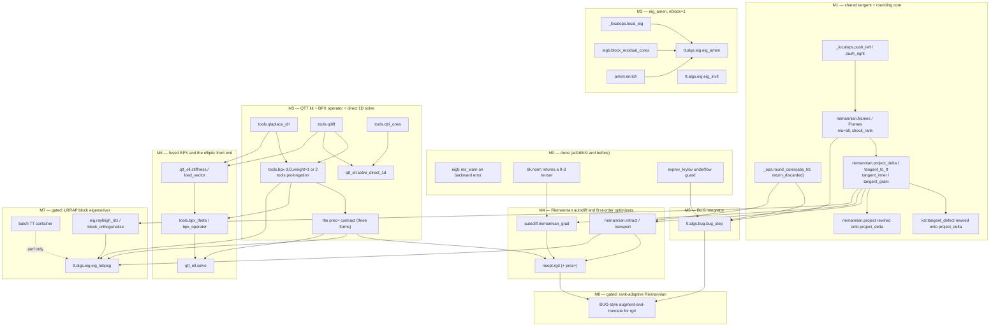

# ROADMAP: integrating the four specs into ttpy2

This document is the **single owner of every cross-spec decision**. The four
specs own their own mathematics; where two of them touch the same function,
the same tolerance or the same object, the resolution is recorded here and the
specs point at it rather than restating it.

Sources, all read in full before this was written:

| spec | owns |
|---|---|
| `docs/plans/bug-integrator.md` | BUG / rank-adaptive robust integrator (Ceruti–Lubich; Ceruti–Kusch–Lubich) |
| `docs/plans/eigenvalues.md` | eigenvalue problems; block AMEn eigensolver, inverse iteration, LRRAP |
| `docs/plans/riemannian-autodiff.md` | manifold geometry, Riemannian autodiff and optimizers, t3f audit |
| `docs/plans/qtt-elliptic-bpx.md` | QTT elliptic operators, BPX, representation conditioning |

plus `docs/REQUIREMENTS.md` (R0–R7), `docs/PERFORMANCE.md`, `docs/COMPAT.md`,
and the code in `tt/`.

**Ground rule for numbers.** Every number below is either cited from one of the
four specs, with the section, or measured here on b300 and marked so. Nothing is
estimated silently; sizes in §4 are explicitly marked as engineering estimates
and are the only unmeasured quantities in the document.

**Measured here** (b300, `~/work/ttpy-modern/ttpy2`, `.venv/bin/python`,
`pytest tests/ -q -n 8`, single run, worktree `worktree-eigenvalues` at
`ad168c9`): **723 tests pass in 46.82 s**. That is the baseline every milestone
below must leave green, and the budget §5 spends.

---

## 0. What is already done, and must not be re-proposed

Three defects found by the four analyses are **fixed and merged**. They appear
in the specs as open defects because the specs were written before the fixes
landed. No milestone below re-proposes them:

| defect | commit | what it was | regression guard |
|---|---|---|---|
| `eigb` returned a wrong eigenvalue with `converged=True` and no warning | `191bbc0` | `res_warn` was a fixed `1e-2`, unrelated to `eps`; six decades of silence. Now `max(sqrt(eps), 8·eps_machine)` on the **backward error** `res_i/‖A‖₂`, with `‖A‖₂` from `eigb.spectral_norm_estimate` (eigenvalues.md §1.2a) | `test_eigb_warns_when_a_too_small_guess_rank_stalls_it`, `test_eigb_does_not_cry_wolf_near_the_bottom_of_the_spectrum`, `test_spectral_norm_estimate_is_a_close_lower_bound` |
| `bk.norm` silently killed the torch autograd graph | `670d84d` | `TorchBackend.norm` returned `.item()`, a python float; a `‖·‖` term contributed exactly zero to the gradient (measured max abs error 7.03e-01, riemannian-autodiff.md §1.4). Dragged `_ops.chop`'s threshold coercion and `bk.is_scalar`/`bk.scalar_dtype` with it | `tests/test_autograd.py` |
| `expmv_krylov` blamed the caller for its own underflow | `231ce52` | zero iterate mid-loop → division by `beta = 0` → `NaN` error estimate → a message accusing the caller. Now returns zero with `underflow=True` in `info` (bug-integrator.md §4(c)) | in `tests/test_eigb_ksl.py` |

Consequence for the plan: **bug-integrator.md §4(c) and riemannian-autodiff.md
§5.1 item 0 are complete**, so `tt.algs.autodiff` is unblocked, and BUG's
stiffness test (bug §7 test 7) can be written against the fixed message.

---

## 1. The dependency graph

Nodes are functions and modules, not themes. `S*` = shared core, `K*` = QTT
construction kit, `A*` = algorithms. Milestone assignment is §4.



The same graph as a table — read this one when you want to know *why* an edge
exists, and the diagram when you want to know *whether* one does.

| item | module / function | needs | needed by | why the edge exists |
|---|---|---|---|---|
| S1 | `tt/core/_ops.py::round_cores(cores, eps, rmax, abs_tol, return_discarded)` | `_ops.chop` (already absolute, line 81) | A3, S4, A5, A1 (optional) | BUG's truncation criterion is absolute and its discarded mass *is* the error estimate (bug §2.5, §4(a)); `retract` needs `return_discarded` as its only local error estimate (riem §8(e)); the eigensolvers' natural criterion is residual-driven, i.e. absolute (eig §4(h)) |
| S2 | `tt/algs/riemannian.py::frames(X, mu=1, *, check_rank=True)` → `Frames` | S6 | S3, A3 | one owner for `U_k, V_k, S_mu`, today rebuilt independently in `project`, `projector_splitting_add`, `ksl.tangent_defect`, `ksl` (riem §2.6 table). BUG's ascent needs the same object with **every** bond matrix at once (bug §4(b)) |
| S3 | `riemannian.project_delta / tangent_to_tt / tangent_inner / tangent_gram` | S2 | S4, A4, A6, `ksl.tangent_defect`, `project` | the gauge cores are computed by `project` today and thrown away (riem §1.1). Without them the tangent Gram matrix costs `O(b² d n r³)` instead of `O(b² d n r²)` ([RNO19] eq. (22)) and the autodiff of [NRO22] Alg. 5.2 has nothing to differentiate with respect to |
| S4 | `riemannian.retract(X, xi, method, rmax, return_discarded)`, `transport` | S1, S3 | A5, A6 | every first-order method needs both; omitting the transport was measured at **60x** self-inflicted cost (riem §2.4) |
| S5 | `tt/algs/_localops.py::local_eig(left, acore, right, nblock, ...)` | — | A1, `eigb` | `eigb._local_eig_dense` / `_local_eig_lobpcg` are private and block AMEn needs the identical thing (eig §4(e)) |
| S6 | `_localops.push_left / push_right`; `riemannian.cores_orthogonalization_step` delegates | — | S2, S3 | one QR step of a sweep is inlined in `ksl`, `amen`, `project` and duplicated in `cores_orthogonalization_step` (riem §2.6) |
| S7 | the `prec=` contract, §3 | A7 (its first real implementation) | A5, A6, A10 | three specs need a preconditioner and propose two incompatible shapes (eig §3.3, riem §6.4 against qtt §4.2) |
| S9 | `eigb.block_residual_cores(acores, xcores, lam)` | — | A1 | the first half of `eigb.block_residuals` builds exactly this and immediately norms it; the enrichment needs the cores (eig §4(f)) |
| S10 | `amen.enrich(core, next_core, extra, direction)` | — | A1 | seven inlined lines in `amen_solve`; block AMEn needs the same seven (eig §4(g)) |
| K1–K3 | `tools.qlaplace_dn`, `tools.qdiff`, `tools.qtri_ones` | `qshift`, `IpaS`, `Toeplitz` — all present and verified (qtt §3.1) | A7, A9, K4 | the DN boundary condition is the *only* one with exactly `2^l` dofs per level, which is what makes the level folding exact (qtt §1.1) |
| K4 | `qtt_ell.stiffness`, `qtt_ell.load_vector` | K1, K2 | A8, A10 | the coefficient enters only through `Lambda` (qtt §3.3); nothing else does |
| A7 | `tools.bpx(d, D, weight=1\|2)`, `tools.prolongation` | K1–K3 | S7, A8, A6, A10 | the object eig §3.3 and riem §6.4 are both waiting for; ranks exactly `2^{2D+1}` measured at `L = 50` (qtt §1.5) |
| A8 | `tools.bpx_theta`, `tools.bpx_operator` | A7, K4 | A10 | the **only** construction measured to survive an iteration past `L ≈ 15` (qtt §2.5) |
| A9 | `qtt_ell.solve_direct_1d` | K2, K3 | — | exact to 5.552e-15 at `L = 40` in 4 ms at rank 3 (qtt §2.4); no iteration, no preconditioner |
| A10 | `qtt_ell.solve(A, f, d, D, precond=...)` | A7, A8, S7 | — | the front end that owns the change of variables and returns the *nodal* solution |
| A1 | `tt/algs/eig.py::eig_amen` | S5, S9, S10 | the TFIM `L = 64` and Heisenberg `L = 16` benchmarks | `eigb` at `B = 1` has **no rank adaptation at all** (eig §1.2) |
| A2 | `tt/algs/eig.py::eig_invit` | nothing new (eig §4(j)) | interior eigenvalues | a day's work; needs *policy*, not algebra |
| A3 | `tt/algs/bug.py::bug_step` | S1, S2, D3 | A11 | KSL's backward `S` substep returns `‖y₁‖ = 1.0677e+108` for a contraction semigroup (bug §3) |
| A4 | `tt/algs/autodiff.py::riemannian_grad` | S2, S3, D2 | A5 | 0.06–1.09x the cost of the explicit route on CPU, up to 54x on GPU (riem §4.4) |
| A5 | `tt/algs/rieopt.py::rgd` (`rcg`, `rlbfgs` later) | S4, A4, S7 | A11 | the first Riemannian solver and the honest baseline for everything after |
| A6 | `tt/algs/eig.py::eig_lobpcg` (LRRAP) | S3, S4, S7, C1, A7 | — | gated, §4 M7 |
| A11 | rank adaptation for `rgd` | A3, A5 | — | riem §5.3 option 4 explicitly waits for the BUG spec to land |
| S11 | batch TT container `(B, r, n, r)` | — | A6 (performance only) | deliberately deferred (eig §4(a)); decided by the experiment of riem §13 Q7 |

Three edges are worth naming because they are not obvious:

* **`A7 → S7`.** The preconditioner *contract* is written last, against a real
  implementation, not first against a hypothetical one. Both consumer specs
  guessed the shape wrong (§3), and they guessed it wrong because no
  preconditioner existed to look at.
* **`A3 → A11`.** riem §5.3 option 4 is "BUG-style augment-and-truncate for
  optimization". It shares an owner with the integrator, so the integrator
  lands first.
* **`S11 ⇢ A6` is dashed** because it is a *performance* edge only: LRRAP is
  correct without a batch container and, in numpy, probably not worth building
  without one (eig §11 Q6, riem §13 Q7).

---

## 2. Shared core work

This is the section that pays for the roadmap existing. Six objects are asked
for by more than one spec, and two of them are asked for with **conflicting
signatures**. Each item below states: who asks, the reconciled signature, the
closest existing function, the owner module, and — where a second
implementation exists today — where it is.

### 2.1 `round_cores` with an absolute budget and a report of what it discarded

**Asked for by three specs, identically:** bug-integrator.md §4(a) (the primary
customer: the discarded mass *is* BUG's step error estimate and its rank
indicator), eigenvalues.md §4(h), riemannian-autodiff.md §8(k).

**No conflict.** All three propose the same signature.

```python
def round_cores(cores, eps=1e-14, rmax=None, abs_tol=None, return_discarded=False):
    """...
    abs_tol: absolute Frobenius budget for the whole truncation, split as
        abs_tol/sqrt(d-1) per bond.  Mutually exclusive with a nonzero eps.
    return_discarded: also return [float] of length d-1: the 2-norm of the
        singular values dropped at each bond.  sqrt(sum(x**2)) is the total
        truncation error and is EXACT -- it is the norm of a discarded
        orthogonal complement, not a cancelling difference.
    """
```

**Closest existing:** `tt/core/_ops.py::round_cores` (line 168), which hard-codes
`delta = eps * ‖Y‖ / sqrt(d-1)` and discards the singular values. Note that
`_ops.chop` (line 81) already takes an **absolute** threshold and already
coerces it off the autograd tape, so the absolute path is a matter of routing
`delta`, not of new numerics.

**Owner:** `tt/core/_ops.py`. One function, extended once — explicitly *not* a
near-duplicate `round_cores_abs`, which is the failure mode bug §4(a) names.

**Second implementations today:** none for the rounding itself, but two
different **per-bond budget denominators** live in the tree and neither
documents why: `_ops.round_cores` and `amen.py:819` use `sqrt(d-1)`,
`eigb.py:457` uses `eps/sqrt(d)` (relative to `‖s‖`, via
`eigb._truncation_rank`). bug §2.5 uses `theta/sqrt(d-1)`. This is a real
inconsistency, found in the code and not asserted by any spec; it is open
question **Q11** in §6 and is **not** silently normalised by M1.

### 2.2 The tangent representation — **the conflict the specs called out**

**Asked for by:** eigenvalues.md §4(b) (for the LRRAP Gram matrix) and
riemannian-autodiff.md §8(a)–(c) (for everything).

**The conflict, quoted.** riemannian-autodiff.md §8(a) states it explicitly:

> The differences: eigenvalues.md has `project_delta(X, Z) -> list[array]`;
> this spec has `project_delta(X, Z, *, weights=None, frames=None) ->
> (deltas, Frames)`. **This spec's signature wins** [...] When this lands,
> `docs/plans/eigenvalues.md` §4(b) must be amended to point here rather than
> restate it.

**Resolution: riemannian-autodiff.md §8(a) wins.** Two measured reasons, both
from that spec: the caller almost always needs the frames immediately afterwards
(`tangent_to_tt`, `transport`, `riemannian_grad` all do) and rebuilding them is
the `O(d n r³)` term of riem §3; and the `weights`/list form is what riem §6.3
measured at `rho_B = 61` summands inside a working preconditioned eigensolver.

**`docs/plans/eigenvalues.md` §4(b) is amended** (see §8 of this document) to
point here instead of restating a second contract.

```python
def project_delta(X, Z, *, weights=None, frames=None):   # -> (deltas, Frames)
def tangent_to_tt(X, deltas, *, frames=None):            # the rank-2r S_k stack
def tangent_inner(deltas_a, deltas_b):                   # O(d n r^2), same point only
def tangent_gram(delta_lists):                           # (b, b), O(b^2 d n r^2)
```

**Closest existing:** `tt/algs/riemannian.py::project` (line 165) computes
exactly these cores inside its sweep and then assembles and discards them
(riem §1.1).

**Owner:** `tt/algs/riemannian.py`. The rule riem §2.6 states and this roadmap
adopts globally: **`tt.algs.riemannian` owns the geometry of `M_r`; every other
module imports it and must not re-derive it.**

**Second implementation today — measured identical.** `tt/algs/ksl.py:347`
`tangent_defect(A, y)` computes `‖(I − P)Ay‖` by its own inlined sweep. riem
§1.5 measured `tangent_defect`, `sqrt(‖z‖² − Σ‖δG_k‖²)` from the deltas, and the
direct `‖z − project(y,z)‖` agreeing to **0.0, 0.0 and 1.54e-16** relative on
three problems. After M1 `tangent_defect` keeps its name and its position in
`ksl.py` (bug §5 relies on that: "`tangent_defect` stays where it is, and BUG
does not call it") but delegates to `project_delta`, which is also *cheaper* —
it drops the second sweep. The bit-comparability of that rewrite is M1's
acceptance test T1.4.

A **third** duplication is kept on purpose: `riemannian.projector_splitting_add`
and `ksl._sweep_forward` are the same Lie–Trotter sweep with different local
solves. riem §1.5 argues against merging them (paying for a Krylov exponential
to get a closed form would be absurd) and asks for a shared test instead. This
roadmap agrees: two implementations, one shared test, documented as deliberate.

### 2.3 The frames — **a second conflict, not called out by either spec**

**Asked for by:** riemannian-autodiff.md §8(d) as
`frames(X, mu=1, *, check_rank=True) -> Frames(U, V, S, r)` in
`tt/algs/riemannian.py`; bug-integrator.md §4(b) as
`mixed_canonical(cores) -> (qL, qR, s, centre)` in `tt/core/_ops.py`.

These are the same mathematical object — the left- and right-orthogonal frames
and the bond matrices of one tensor — proposed twice, in two modules, with two
signatures and two input types. Neither spec noticed the other. **Three
substantive differences, and the third one is decisive:**

1. *Module.* `_ops` (core) versus `riemannian` (geometry).
2. *Scope.* `mixed_canonical` returns the bond matrix and the centre core at
   **every** bond at once; `frames` returns one requested `mu`. BUG's ascent
   genuinely needs all of them (bug §2.5, phase 0).
3. *Rank deficiency.* `frames(check_rank=True)` **refuses** a rank-deficient `X`,
   because at a corner of the manifold the closed form returns a Hermitian
   idempotent of the wrong space (riem §1.1 records 31 % relative error against
   the dense projector). BUG must **not** refuse: robustness to arbitrarily
   small singular values is the entire point of the method ([CL22] Thm 4's
   constants are independent of the singular values; bug §3).

**Resolution: one owner, `tt/algs/riemannian.py::frames`, with `mu='all'` and an
explicit `check_rank` flag.**

```python
def frames(X, mu=1, *, check_rank=True):
    """Left- and right-orthogonal frames of X and its mu-orthogonal core.

    mu='all' additionally returns, for every bond, the bond matrix s[k] and the
    centre core centre[k] = s[k-1] @ V[k] -- what a mixed canonical form is, and
    what a BUG ascent needs (bug-integrator.md Sec. 2.5 phase 0).
    check_rank=False skips the refusal of a rank-deficient X.  THE TANGENT SPACE
    IS THEN UNDEFINED: this flag is legal only for callers that never build a
    tangent projector, which today means the BUG sweep alone.
    """
```

`X` accepts a `tt.vector` or a bare core list, because BUG works on cores.
**`docs/plans/bug-integrator.md` §4(b) is amended** (§8) to drop the
`_ops.mixed_canonical` proposal and point here.

The cost of this decision, stated: `tt/algs/bug.py` acquires an import of
`tt/algs/riemannian.py`. That is the same dependency direction riem §2.6 already
imposes on `ksl`, and it is the price of not having two owners of the frames.

### 2.4 Block / tensor-of-tensors representation

**Asked for by:** eigenvalues.md §4(a) (a batched container, T3F layout
`cores[k] : (B, r, n, r)`, **deliberately deferred**: "a plain `list[tt.vector]`
is sufficient"), riemannian-autodiff.md §7.2 and §13 Q7 ("the interesting one",
with t3f's measured batch-vs-single per-object times on a V100: matvec
0.744 → 0.14 ms, gram 0.973 → 0.001 ms).

**No signature conflict, but a representation decision that must be stated
once.** ttpy2 will carry **two** block representations, deliberately, with
disjoint owners:

| representation | owner | who uses it | why not the other one |
|---|---|---|---|
| block TT, `y.r[-1] == B`, block index riding the current site | `tt/algs/eigb.py` and `tt/algs/eig.py` | `eigb`, `eig_amen` | it is what the ALS sweep *is*; `_localops.local_matmat` already takes a `(r, m, r, k)` stack and `_ops.dot` already returns the block Gram when the boundary ranks exceed 1 |
| a sequence of separate `tt.vector`s (a list today, a batched container later) | `tt/algs/eig.py::eig_lobpcg`, `tt/algs/rieopt.py` | LRRAP, Riemannian methods | the whole point of [RNO19] is to *avoid* the block-TT rank `~ B r₁`, measured at 2, 4, 8, 14, 20 for `B = 1, 2, 4, 8, 16` on `qlaplace_dd([8])` (eig §1.3) and 5 → 120 in their Table 5 |

The API of eigenvalues.md §5 is written so that a list and a batched container
both satisfy "a sequence of `tt.vector`", so S11 can be introduced later without
changing a signature. **The batch container is not scheduled**; it is gated on
the half-day experiment of riem §13 Q7 (§6 Q5 below).

### 2.5 The enrichment / augmentation family — two operations, not one

**Asked for by:** eigenvalues.md §4(g) (`enrich`, for block AMEn),
bug-integrator.md §2.5 (basis augmentation), riemannian-autodiff.md §5.3 option 3
("grow into the normal space — the manifold analogue of AMEn's residual
enrichment").

It is tempting to give these one owner. **They are different operations and get
different owners**, and this roadmap records why so that nobody merges them:

* `amen.enrich(core, next_core, extra, direction)` — concatenate along the
  moving bond, **zero-pad the neighbour**, re-orthogonalize. The represented
  tensor is *unchanged*; only the rank grows. Owner: `tt/algs/amen.py`, imported
  by `tt/algs/eig.py`. Closest existing: the seven inlined lines in
  `amen_solve` (`bk.concatenate` / `bk.zeros` / `_qr_left` / `_push_left`).
* BUG's augmentation — concatenate `[OLD, G1]` along axis 0 and
  `right_orthogonalize`, **no zero padding**, and a change-of-basis matrix
  `Mhat` carrying the old tensor into the new space (bug §2.5). The represented
  *space* is deliberately doubled. Owner: `tt/algs/bug.py`, private.

What they genuinely share is `_localops.left_orthogonalize` /
`right_orthogonalize`, which already exist and already have one owner.
riem §5.3 option 3 is a third thing again (extracting normal *directions*, whose
cost riem §5.3 states and does not measure) and is gated as §6 Q8.

### 2.6 History and telemetry

**Asked for by:** all four (bug §5 `BugHistory`, eig §5 `EigHistory`, riem §9
`RiemHistory`, qtt §3.2 `solve(...) -> (v, info)`), and by R7, which requires
every iterative algorithm to return a programmatically accessible history.

Existing: `KslHistory`, `EigbHistory`, `AmenSolveHistory`, `GmresHistory`,
`CompletionHistory`.

**Resolution: no base class and no inheritance** — a shared parent would put a
second owner between an algorithm and its own telemetry. Instead the *names and
units* have one owner, this table, and every new dataclass uses them:

| field | meaning | produced by | appears in |
|---|---|---|---|
| `converged: bool` | the run reached what the caller asked for | the algorithm | all |
| `converged_per_eig: ndarray[bool]` | per eigenvalue, not per run | `eig_amen` | `EigHistory` (eig §5: the field `EigbHistory` should have had) |
| `ranks: list` | TT ranks of the returned object | the algorithm | all |
| `discarded: list[float]` | per-bond 2-norm of dropped singular values | **`round_cores(return_discarded=True)`** (S1) | `BugHistory`, `RiemHistory` |
| `trunc_error: float` | `sqrt(sum(discarded**2))`, exact | S1 | `BugHistory` |
| `normal_defect: float` | `‖(I − P)z‖`, the rank-adaptation signal | **`project_delta`** (S3), via `ksl.tangent_defect` | `KslHistory`, `RiemHistory` |
| `res`, `res_rel` | measured eigen/linear residual and its backward error `res/‖A‖₂` | the algorithm | `EigbHistory`, `EigHistory` |
| `time: float`, `message: str` / `stop_reason: str` | | the algorithm | all |

The rule this encodes: **a telemetry field that can be produced by a shared
routine must be produced by it**, so that `discarded` means the same thing in
`BugHistory` and `RiemHistory`, and `normal_defect` means the same thing in
`KslHistory` and `RiemHistory`.

### 2.7 One-owner moves with a single asker

Listed for completeness; they are SSOT work inside one family, not cross-spec
reconciliation, and they ride along with the milestone that needs them.

| item | from | to | asked by |
|---|---|---|---|
| `local_eig(left, acore, right, nblock, *, guess, tol, max_full_size, sym_tol, maxiter)` | `eigb._local_eig_dense`, `eigb._local_eig_lobpcg` (private) | `tt/algs/_localops.py` | eig §4(e) |
| `block_residual_cores(acores, xcores, lam)` | the first half of `eigb.block_residuals` | `tt/algs/eigb.py`, public | eig §4(f) |
| `push_left` / `push_right` | inlined in `ksl`, `amen`, `project`; duplicated in `riemannian.cores_orthogonalization_step` | `tt/algs/_localops.py`; `cores_orthogonalization_step` keeps its name and delegates (R2) | riem §2.6 |
| `rayleigh_ritz(A, basis, *, nev, gram_tol)`, `block_orthogonalize(vectors, *, eps, method)` | nothing exists | `tt/algs/eig.py` | eig §4(c), §4(d) |

---

## 3. The preconditioner contract

Three consumers need one — `eig_lobpcg`/`eig_invit` (eig §3.3), `rgd`/`rcg`
(riem §6.4), `qtt_ell.solve` (qtt §4.2) — and the three specs do **not** agree.

### 3.1 The disagreement

eigenvalues.md §3.3 item 1 and riemannian-autodiff.md §6.4 item 1 both require
`B⁻¹` to be "exposable **as a list of rank-1 TT-matrices**, not only as a
black-box `apply`", and riem §6.4 calls a callable "the slow path". That is
[RNO19] eq. (24)–(25), and it is *measured to work* — riem §6.3 got 10, 11, 12
iterations across a 242-fold increase of `kappa` with `rho_B = 41..61` rank-1
terms.

qtt-elliptic-bpx.md §4.2 item 1 answers, from the side of the only
preconditioner anyone actually built: **"This is the wrong shape for BPX, and
the 'slow path' framing is wrong."** BPX is a *single* `tt.matrix` of TT rank
`2^{2D+1}` — measured exactly 8 / 32 / 128 for `D = 1, 2, 3` at `L = 20, 30, 50`
(qtt §1.5) — and it cannot be written as a sum of rank-1 terms. The rank-1
route was measured *not to transfer* to the by-scale setting: the QTT ranks of
`expm(-t A_DN)` are 8–21, not 1 (qtt §2.3), so `rho_B ≈ 40..60` terms of rank
≈ 15 would cost more than an AMEn sweep.

Both are right about their own problem class. Neither is right in general.

### 3.2 The contract

**`prec=` accepts exactly three forms, and every consumer must handle all
three.** The form is *declared*, not sniffed.

```python
# form 1 -- list[tt.matrix], every element of TT rank 1.
#   [RNO19] eq. (24).  The Kronecker-sum-over-physical-modes case.
#   Consumed directly by riemannian.project_delta(X, [B_q @ z ...], weights=c):
#   no intermediate of rank rho_B * R * r is ever formed (riem Sec. 6.2).
#   Measured: rho_B = 41/51/61, 10/11/12 iterations to 1e-3 across
#   kappa = 4.4e2 .. 1.1e5 (riem Sec. 6.3).
prec = [B_1, ..., B_rho]

# form 2 -- a single tt.matrix of small, DECLARED TT rank.
#   The BPX case, and the ONLY form that works in the by-scale (QTT) setting.
#   One matvec plus one rounding: the same cost as one extra matvec by A,
#   whose rank is 3-4.  NOT a slow path (qtt Sec. 4.2 item 1).
#   Measured: rank exactly 2^(2D+1) = 8/32/128, independent of L (qtt Sec. 1.5).
prec = tt.bpx(d, D, weight=2)

# form 3 -- a callable prec(z) -> tt.vector.
#   The escape hatch: multigrid V-cycles, anything iterative.  The only form
#   that cannot declare a rank, and the genuinely slow path.
prec = lambda z: my_vcycle(z)
```

Every form carries two declarations the consumer must be able to read without
applying it:

* **`side`** — `'left'` (`B⁻¹ ≈ A⁻¹`, used as `B⁻¹ r`) or `'two-sided'` (a
  change of variables `C A C`). This is not decoration. qtt §1.4 measured that
  the eigensolver and the linear solver want **different** BPX operators:
  `C_{2,L} = Σ_l 2^{-2l} P_l P_lᵀ` (left, `kappa(C₂A)` = 5.12 → 8.44 for
  `L = 4..13`) and `C_L = Σ_l 2^{-l} P_l P_lᵀ` (two-sided, `kappa(CAC)` = 5.67 →
  11.82). One function, `tt.bpx(d, D, weight=1|2)`, one scalar changed — do not
  build two. Minimizing the Rayleigh quotient of `C A C` returns the eigenvector
  of the *preconditioned* operator, not of `A` (qtt §8 Q6).
* **`spd: bool`** — declared by the constructor and asserted by a test, never
  assumed. See F4.

### 3.3 What the contract forbids

**F1 — no consumer may realise a two-sided preconditioner by assembling
`round(C @ A @ C)`.** Measured (qtt §1.6): the relative error of the action of
`round(C@A@C, 1e-14)` against the mathematically identical combined operator is
1.315e-10 / 5.998e-04 / 2.614e+02 / 1.472e+08 / **4.770e+14** at
`L = 10/20/30/40/50`, tracking `4^L · eps` to within a factor 1.1 at every `L`.
A two-sided preconditioner is available **only** as a fused constructor
(`tt.bpx_theta`) returning the combined representation. Consequently `prec=`
only ever carries a **left** preconditioner; the two-sided change of variables
is a different entry point (`qtt_ell.solve(precond='bpx')`), which owns the
change of variables and returns the *nodal* solution.

**F2 — the exact `D = 1` inverse is not reachable through any generic
`precond=`.** `T = (I − S)⁻¹` is QTT rank 2 and `Tᵀ A_a T = diag(a)` exactly, so
as a **direct solve** it is unbeatable: relative nodal error 5.552e-15 at
`L = 40` (`2^40 ≈ 1.1e12` nodes) in 4 ms at rank 3 (qtt §2.4). As a
**preconditioner** it is a disaster of exactly [BK20]'s kind:
`round(TᵀAT, 1e-14)` has TT rank **13** for a matrix that is exactly the
identity, and `amen_solve` on it at `L = 30` returns `converged=True` with
`true_res = 2.64e-09` and an answer **96.7 % wrong** (qtt §2.4, `p10_int.py`).
So `T` is reachable only through `qtt_ell.solve_direct_1d`, which raises for
`D > 1` and for any operator not of the form `Mᵀ diag(a) M`, and **has no
approximate mode**. `qtt_ell.solve` has no `precond='int'` option; qtt §3.2
already writes the refusal into the signature and V12b freezes it as a test.

**F3 — `amen_solve` gets no global `prec=` argument.** qtt §4.1 read the code:
`local_prec` is a *block-Jacobi preconditioner of the local `r_k n_k r_{k+1}`
GMRES solve* (`amen._jacobi`), a different object with no effect on the outer
sweep. Adding a global one would create a second owner of the preconditioning
decision, which already lives in `qtt_ell.solve`. The already-preconditioned
system is passed in, which is what [BK20] themselves do (their §7.2). This is
**not** a defect for the two-sided case (qtt §4.1).

**F4 — a preconditioner that cannot declare SPD may not be passed to any
Rayleigh–Ritz-based method.** eig §3.3 item 2 and riem §6.4 item 2 agree: the
`2×2` / `3b×3b` pencil loses its variational characterization, and with it the
"Ritz values decrease monotonically" invariant that eig §8 test 8 asserts.
`tt.bpx` satisfies SPD by construction — `C_L ⪰ 2^{-L} I` since `P_{L,L} = I`
(qtt §4.2 item 2), and `lambda_min(Chat A Chat) = 2.0000` was measured at every
`L` from 4 to 13 — so it declares `spd=True` and a test checks it densely at
`d ≤ 12`.

**F5 — required loudness, not a prohibition.** A form-2 preconditioner of
declared rank `r_B` multiplies the iterate rank by `r_B` before rounding, and a
form-1 preconditioner costs `rho_B` matvecs per application. Every consumer's
history must carry the pre-rounding rank and the applications-per-iteration
count, so that the two measured traps are visible rather than folkloric: the
`rho_B = 61` cost discount (riem §6.3: 875 → 16 iterations is a factor 55, but
1.4 s → 0.1 s is only a factor 14) and the "40–60 terms of rank 15 costs more
than one AMEn sweep" arithmetic of qtt §2.3.

### 3.4 What the contract does not deliver

Stated here so that no milestone promises it:

* **No preconditioner for the indefinite `A − sigma I`** of an interior
  shift-and-invert. BPX is built from a norm equivalence, which needs coercivity
  (eig §3.3, qtt §4.2 item 5). eig §7.3 measured what happens without one:
  `amen_solve` correctly refuses at `true residual 5.502`.
* **No help with coefficient contrast.** Measured: `kappa(BPX) = 1.12e+05` at
  contrast `1e4`, i.e. the contrast passes straight through, and
  `kappa(INT) = 10000.0000` does too (qtt §2.4). Neither paper solves this.
* **No effect on the ALS/AMEn family's sweep count.** eig §3.1 and qtt §2.1 both
  measured that ALS convergence is not governed by `kappa` in the way a gradient
  method's is; what a preconditioner fixes there is the *accuracy floor*, not
  the sweep count. `eig_amen` therefore takes no `prec=` at all — its local
  GMRES already has three (`local_prec='c'/'l'/'r'`).

---

## 4. The ordered plan

Sizes are an **engineering estimate**, the only unmeasured quantity in this
document; where a spec states its own estimate the citation is given. Every
acceptance criterion is a test with a named oracle and a number.

### M1 — the shared tangent and rounding core

**Startable immediately.** Nothing in it is research; every contract number
below is already measured.

**Lands:** S6 (`_localops.push_left/push_right`, `cores_orthogonalization_step`
delegates), S2 (`riemannian.frames` / `Frames`, `mu='all'`, `check_rank`),
S3 (`project_delta`, `tangent_to_tt`, `tangent_inner`, `tangent_gram`),
S1 (`_ops.round_cores(abs_tol=, return_discarded=)`), and the rewiring of
`riemannian.project` and `ksl.tangent_defect` onto `project_delta`.

**Why first.** Three of the four specs depend on it (`A3`, `A4`, `A6` in the
graph) and nothing depends on it being *late*. riem §5.1 measured the payoff
directly: `project_delta` is "`project` with two lines changed", and it is what
makes the [NRO22] autodiff — 0.06–1.09x the cost of the explicit route on CPU
and 54x cheaper on a GPU at `d=20, n=8, r=40` (riem §4.4) — expressible at all.
It also discharges the project's own SSOT rule against the two measured
duplications: `ksl.tangent_defect` versus `project` (agreement 0.0, 0.0,
1.54e-16, riem §1.5) and the four independent frame sweeps (riem §2.6).

**Acceptance.**

| # | test | oracle | number |
|---|---|---|---|
| T1.1 | `round_cores(x, eps=0.0, abs_tol=t, return_discarded=True)` on a TT with a planted bond spectrum | the identity `sqrt(Σ discarded²) = ‖x − round(x)‖`, **exact** because the discarded mass is a norm of an orthogonal complement (bug §4(a)) | agreement `≤ 4·eps(float64)·‖x‖` (R4's rule: no tolerance tighter than `4·eps·scale`); and `‖x − round(x)‖ ≤ t` |
| T1.2 | gauge condition and rebuild (riem §10 test 2) | [RNO19] eq. (21) and `project` | `max_k ‖ML(δG_k)^H ML(U_k)‖ ≤ 8·eps·d` (measured 7.9e-16 at `d=4`, 7.1e-15 at `d=6`, 4.3e-14 at `d=10` — so the threshold must grow with `d`); rebuild relative `≤ 1e-14` (measured 2.9e-16 … 9.5e-16) |
| T1.3 | `tangent_inner` against `tt.dot(tangent_to_tt(a), tangent_to_tt(b))` (riem §10 test 3) | [RNO19] eq. (22) | relative `≤ 1e-14` (measured 3.6e-16 … 8.1e-16). This is also the test that pins the **minus** in the gauge projection: [NRO22] eq. (5.11) has a minus and their Alg. 5.2 line 9 has a plus; only the minus reproduces `project` (riem §4.3) |
| T1.4 | `ksl.tangent_defect` after the rewrite (riem §10 test 12) | today's value on `d,n,r,R = (6,4,3,2), (10,2,4,3), (8,3,2,2)` | `≤ 1e-14` relative (measured agreement today 0.0, 0.0, 1.54e-16) |
| T1.5 | `frames(X, mu='all', check_rank=False)` at a rank-deficient point | the definition: the centre cores must reproduce `X` | reproduces to `4·eps·‖X‖`, and **does not raise**; with `check_rank=True` it raises with the existing message (`test_project_refuses_a_rank_deficient_point`) |
| T1.6 | the whole suite | itself | still **723 passed**, wall `≤ 60 s` at `-n 8` on b300 (measured baseline here: 723 in 46.82 s) |

**Size:** M (~350–450 new lines in `riemannian.py` and `_ops.py`, ~150 of tests).
riem §5.1's own estimate: "`assemble` is 12 lines and `riemannian_grad` is 20
lines on top" of a two-line change to `project`.

**Counterweight.** M1 buys nothing a user can see. Its entire payoff is
downstream, and riem §13 Q2 is honest that in the **QTT regime** (`n = 2`) the
whole tangent machinery may never be worth it: `project` was measured
dispatch-bound (3.93 → 3.95 → 4.26 ms while `r_z` went 20 → 40 → 80), and
riem §6.1 measured the tangent projection buying *nothing* over plain truncation
on `qlaplace_dd` (1398 iterations against 1413).

### M2 — `eig_amen` with `nblock=1`, and `eig_invit`

**Lands:** S5 (`_localops.local_eig`), S9 (`eigb.block_residual_cores`),
S10 (`amen.enrich`), `tt/algs/eig.py` with `eig_amen` and `eig_invit`, and the
`_FUNCTIONS` entries. `tt/algs/eigb.py` and `tt/eigb/__init__.py` are
**untouched** (R2; `test_legacy_imports` must keep passing).

**Why here.** It is independent of M1 — the graph has no edge between them, so
it may be built in parallel or first — and it closes the single largest measured
defect in the toolbox. eig §1.2: on the `d = 10` Heisenberg chain with `B = 1`
and a rank-4 guess, `eigb` returns an eigenvalue wrong by **6.10e-03**, reports
`converged = True`, and *structurally cannot* improve, because with `B = 1` the
TT ranks are non-increasing along every sweep. It is ordered after M1 only
because M1 unblocks three specs and this unblocks one.

**Acceptance.**

| # | test | oracle | number |
|---|---|---|---|
| T2.1 | the rank-adaptation test (eig §8 test 3): Heisenberg `d=10`, `B=1`, `r0=4`, `eps=1e-8`, seed 0 | `numpy.linalg.eigvalsh`, `E_0 = -4.258035207283` | `eig_amen(kickrank=0)` reproduces the failure: `|λ − E_0| > 1e-4` (measured 6.10e-03) and `res_rel > 1e-3` (measured 2.84e-02). `eig_amen(kickrank=4)` reaches `|λ − E_0| ≤ 1e-9` and backward error `≤ 1e-6` |
| T2.2 | `kickrank=0` reproduces `eigb` bit-for-bit (eig §8 test 10) | `eigb` itself — the one place where that is the right oracle | `qlaplace_dd([8])`, `B=4`, same seed; identical to `1e-14` |
| T2.3 | Ritz-value monotonicity (eig §8 test 8) | the invariant: an ALS sweep with orthonormal frames is a Galerkin restriction | `Σλ_{s+1} ≤ Σλ_s + 8·eps_machine·|Σλ_s|` over `history.lam_per_sweep`. The cheapest possible detector of a broken interface convention, and the enrichment must not break it |
| T2.4 | QTT Laplacian 1D analytic spectrum (eig §8 test 1) | `λ_k = 4 sin²(kπ/(2(N+1)))`, no dense computation | `d = 8, 12`, `B = 1, 4`: `|λ_k − exact| ≤ 1e-10·exact + 1e-14` (measured headroom: `eigb` gives 3.31e-12 relative at `d=8, B=1`) |
| T2.5 | `eig_invit` returns *an* eigenpair and says which one it is not (eig §8 test 6) | the dense spectrum of Heisenberg `d=10` | the returned pair matches *some* dense eigenvalue to `1e-10` and the history does **not** claim it is the smallest; `refine='rayleigh'` from a cold start raises |

**Honest counterweight, at the point of recommendation.** T2.1's `≤ 1e-9` target
is an **inference, not a measurement**: eig §10 states plainly that no prototype
of the block AMEn eigensolver exists and that "it fixes the `B = 1` failure" is
an inference from what AMEn does for linear systems. The measured anchor is the
shifted `amen_solve` of eig §7.2 — `5.97e-12` in 6 solves / 0.7 s at
`sigma = -4.3`, a shift 1 % below `E_0`. If T2.1 misses `1e-9`, the outcome of
this milestone is open questions Q1/Q2, not a pass. And `eigb` is **not** broken
for `B ≥ 2`: on every problem tried it reached `1e-14` (eig §1.3, §7.4), so
`eig_amen` must earn its `kickrank` there rather than being assumed better —
which is exactly Q2.

**Size:** M–L. eig §2.1 item 3's own estimate for the `B = 1` case: "perhaps 60
lines on top of `tt/algs/amen.py`, reusing `_project`, `_apply`, `_phi_next`,
`_phi_yy_next`, `_truncate` unchanged", plus the three moves of §2.7 and
`eig_invit` ("a day's work", eig §2.5).

### M3 — the QTT kit, the BPX operator, and the direct 1D solve

**Lands:** K1–K3 (`qlaplace_dn`, `qdiff`, `qtri_ones` — qtt §3.1 verified that
`qshift`, `IpaS` and `Toeplitz(..., kind='L')` already do the work, so these are
wrappers), A7 (`tt.bpx(d, D, weight=1|2)`, `tt.prolongation`), A9
(`qtt_ell.solve_direct_1d`), and S7 — the §3 contract, written against A7.

**Why here.** It is the object *two other specs are explicitly waiting for*
(eig §3.3, riem §6.4) and it is measured cheap: ranks exactly 8 / 32 / 128 for
`D = 1, 2, 3`, independent of `L`, built in under 1 s at `L = 50, D = 3`
(qtt §1.5). qtt §2.5 rates step 1 at "half a day" and step 2 at "one day". It
also forces the preconditioner contract to be written against a real object
rather than a hypothetical one, which is what both consumer specs got wrong.

**Acceptance.**

| # | test | oracle | number |
|---|---|---|---|
| T3.1 | V4: the ranks are the theoretical ones | [BK20] Theorem 3 — the construction is explicit, so a different rank is a bug, not compression | `bpx(d, D, weight=w).r` **exactly** `2^{2D+1}` for `d ∈ {8,20,50}`, `D ∈ {1,2,3}`, `w ∈ {1,2}` (measured 8/32/128) |
| T3.2 | V1/V2/V11: cores against dense | closed forms [BK20] (14), (80); and the `8×8` tridiagonal | `0 ≤ l ≤ L ≤ 7`, `1e-12` / `1e-11`; and `bpx(3,1).full()` against dense `2³ Σ_l 2^{-l} P_l P_lᵀ` to `1e-14` — the guard for the BK→ttpy2 bit-reversal of qtt §1.1, which is the one thing here that is easy to get silently backwards |
| T3.3 | V5: SPD and the condition-number bound | `numpy.linalg.eigvalsh` on the dense `B = Θᵀ Θ`, `d = 4..12`, `D = 1` | `λ_min > 1.5`, `λ_max < 30`, `κ < 15` (measured 2.0113…2.0000 / 11.40…22.98 / 5.67…11.49) **and** `κ(A_DN) > 1e7` at `d = 12` (measured 2.72e+07), so the test fails if the operator being preconditioned is accidentally benign |
| T3.4 | V12a: the direct 1D solve | `u(x) = x − x²/2`, and the theorem that P1 Galerkin is nodally exact in 1D | `d = 40`: relative nodal error `< 1e-13` (measured 5.552e-15) and iterate rank `== 3` |
| T3.5 | V12b: the frozen trap | the identity `(I−S)T = I` | `round(TᵀAT, 1e-14)` has TT rank `> 3` even though the exact product is the identity (measured 13); and `qtt_ell.solve(..., precond='int')` raises `ValueError` — the API half of F2 |

**Counterweight.** qtt §2.5 says it plainly: if the target is `D ≥ 2` from day
one, K1–K3 and A9 are a detour — skip to M6, which does not depend on them. And
if the target is `L ≤ 12`, none of this is needed: plain `amen_solve` on
`qlaplace_dd` converges in 3 sweeps to 5e-10 there (qtt §2.1).

**Size:** M (qtt §2.5: half a day + one day, plus the contract and the tests).

### M4 — Riemannian autodiff and the first optimizer

**Lands:** S4 (`retract`, `transport`), A4 (`tt/algs/autodiff.py`:
`riemannian_grad`, `riemannian_hvp`, `euclidean_grad`), A5
(`tt/algs/rieopt.py::rgd` with `prec=` per §3).

**Why here.** It needs M1 (S3) and it wants M3 (a real form-2 preconditioner to
test S7 against). riem §5.1's three measured reasons: torch autograd already
flows through 13 of 15 TT functionals built from existing ttpy2 ops, correct to
1e-9 or better against central finite differences (riem §4.1); [NRO22] Alg. 5.2
reproduces `project(X, ∇f)` to 1.5e-15 in our conventions on a functional whose
Euclidean gradient has rank **59** against a manifold rank of 3 (riem §4.3); and
it is 8–17x faster than what ttpy2 can do today on CPU (riem §4.4).

**Acceptance.**

| # | test | oracle | number |
|---|---|---|---|
| T4.1 | riem §10 test 4 | `2·project(X, A X)`, computed on the other backend | `‖riemannian_grad(f,X) − 2 P_X(AX)‖/‖·‖ ≤ 1e-13` for `f = <AX,X>` (measured 1.48e-15, 2.63e-15, 2.48e-15) |
| T4.2 | riem §10 test 6 (fail loud) | the definition: a Riemannian gradient of a function of the *cores* does not exist | `runtime_check` **raises** on `f = sum(c.sum() for c in cores)`, naming the relative discrepancy. t3f prints a warning here; we raise |
| T4.3 | riem §10 test 8 (regression guard, forever) | central finite differences | `riemannian_grad` on `‖x − b‖²` matches FD to `1e-6`. This is the `bk.norm` defect of §0; it is the one test that must never be deleted |
| T4.4 | riem §10 test 7 (fail loud) | the reproducer of riem §4.2 (singular values exactly `(1,1)`) | `riemannian_grad` raises when the deltas contain a non-finite entry, naming the SVD. Expected to *stay*: it pins a torch property we do not control, and it is why `riemannian_grad` never puts an SVD on the tape |
| T4.5 | riem §10 test 10: the preconditioned iteration count is `κ`-independent | `λ_1 = D·4 sin²(π/(2(n+1)))`, analytic | `D=4`, `n = 32` and `128`, manifold rank 1, `ρ_B = 41/51`: preconditioned reaches relative `1e-8` in `≤ 25` iterations (measured 16 and 17) **and** the unpreconditioned run at `n=128` does not reach `1e-3` in 200 (measured: not in 3000). The second assertion is what makes the test about the preconditioner and not about the problem |

**Counterweight, at the point of recommendation.** riem §5.2 measured
`ttSparseALS` beating Riemannian GD **4–5x in wall clock** on completion above
the sampling threshold (1.2 s against 5.4 s at `|Ω| = 100 × dof`), while GD is
5 orders of magnitude more accurate (1.6e-13 against 6.6e-08). Do not sell
Riemannian completion as faster. Worse, the iteration count is not reproducible:
the *same* problem at the *same* `|Ω|` with a different draw of Ω took **1420**
iterations instead of 59. A `maxit` chosen from one run is worthless, and
`rcg` — the standard next step — was measured **worse** than `rgd` in one regime
(2000 iterations without reaching 1e-6 where GD reached 3.4e-13). `rcg` is
therefore *not* in this milestone.

**Size:** L. riem §5.1 items 1–5.

### M5 — the BUG integrator

**Lands:** `tt/algs/bug.py::bug_step`, `BugHistory`, and a `tt/bug/__init__.py`
shim if we want to match the `tt.ksl` style.

**Why here.** It needs M1 (S1 for the absolute truncation and the discarded
report; S2 for the mixed canonical form) and it needs the already-landed
`expmv_krylov` fix. Its payoff is a *correctness* one that KSL structurally
cannot deliver: on the QTT heat equation `A = −(2^L+1)²·qlaplace_dd([L])` at
`τ‖A‖ = 169`, KSL **returns a number** — a tensor of norm 1.0677e+108 for a
dissipative flow whose exact solution has norm 0.090 — without raising
(bug §3). At `L = 10`, `τ‖A‖ = 42`, KSL returns `‖y₁‖ = 27.9 > 1 = ‖y₀‖`, a
growing solution of a contraction semigroup. BUG is nonexpansive
*unconditionally in τ*.

**Acceptance.**

| # | test | oracle | number |
|---|---|---|---|
| T5.1 | bug §7 test 1 | `scipy.linalg.expm(τA) @ y0.full()` | `d = 1` and `d = 2` with maximal ranks: exact to `local_tol` |
| T5.2 | bug §7 test 5, the conservation law | the contraction property `‖y₁‖ ≤ ‖y₀‖`, a mathematical invariant, not a reference solution | `‖y₁‖ ≤ ‖y₀‖(1 + 8 eps_mach)` at `τ‖A‖ ∈ {0.2, 1.7, 16.9, 169}`, `L = 6`. The KSL arm is `xfail` with the measured **1.0677e+108** in the reason, so the regression is visible rather than folklore. Second arm `L = 10`, `τ‖A‖ = 42`: KSL 27.9, BUG 9.86e-02 |
| T5.3 | bug §7 test 2, order | dense `expm`, and the *order* is the assertion | global error over `T=1` at `N ∈ {4,8,16,32,64}`, observed order `≥ 0.9` ([CL22] Thm 4 guarantees 1). **Record** the measured 1.97, 1.98, 1.99, 2.00 without asserting it — see Q9 |
| T5.4 | bug §7 test 6, THE fail-loud test | the same run started from full ranks | with `reject=False`: `history.rank_capped is True` on the first steps and a `RuntimeWarning` naming the cap; it must **not** return `trunc_error < θ` and no other signal (measured: final error 3.180e-03 against 3.408e-06, a factor 933, entirely from the doubling cap, and *invisible* in `trunc_error`). With `reject=True`: `retries > 0` and the error drops materially below 3.180e-03 |
| T5.5 | bug §7 test 8 | invariants, no oracle | fixed-rank BUG preserves ranks exactly; rank-adaptive BUG with `θ = 0` never truncates. These catch the absolute/relative off-by-one that M1's S1 introduces |
| T5.6 | bug §6 falsifiable sub-predictions | the cost model | exactly `d` local exponentials per step; augmented ranks exactly `[1,4,8,8,4,2,1]` on the reference problem; `ratio_to_ksl ∈ [0.45, 0.70]` (measured 0.60 rank-adaptive, 0.48 fixed rank) |

**Counterweight.** BUG loses three things KSL has, all measured or cited in
bug §1: time-reversibility; norm and energy conservation for Schrödinger; and
**exactness when the manifold is the whole space** — `ksl` reproduces
`expm(τA)y₀` to 1.0e-15 on `d=6, n=2, r=[1,2,4,8,4,2,1]` where BUG gives
1.99e-05 at `τ = 0.1`. It is also *not* stiff-stable: at `τ‖A‖ = 1690` BUG's own
Krylov substeps underflow and it raises too (bug §3). And **TT-BUG has no
intra-step parallelism at all** (bug §6): the parallelism in both papers is over
the children of a node, and a TT is a caterpillar. Do not sell it as parallel.

**Size:** L (~500 lines + tests). The sweep reuses `_localops` unchanged.

### M6 — the fused BPX and the elliptic front end

**Lands:** K4 (`stiffness`, `load_vector`), A8 (`bpx_theta`, `bpx_operator`),
A10 (`qtt_ell.solve`).

**Why here.** It needs M3. It is the only construction measured to survive an
iteration past `L ≈ 15` (qtt §2.5) and the only route to `D = 2` at all.
Measured payoff (qtt §2.2): 6 AMEn sweeps flat from `L = 14` to `L = 30`, nodal
error ~4e-12, **0.33 s** at `L = 30` (`2^30 ≈ 1.07e9` nodes) where the
unpreconditioned solve takes 25.13 s to be **100 % wrong**.

**Acceptance.**

| # | test | oracle | number |
|---|---|---|---|
| T6.1 | V6, manufactured solution | `u = x − x²/2`, nodally exact for P1 in 1D | `d = 20`, BPX at `eps = 1e-10`: relative nodal error `< 1e-9` (measured 4.4e-12 at `d=18`, 1.2e-11 at `d=30`, at `eps = 1e-8`) **and** the same call with `precond='none'` gives `> 1e-6` (measured 3.29e-05 at `d=18`). Without the second assertion the test passes for the wrong reason |
| T6.2 | V8, THE loud-failure test | the two routes are the same matrix in exact arithmetic | `d = 40, D = 1`: `‖B_comb v − B_sep v‖/‖B_comb v‖ > 1e+3` (measured **1.472e+08**), with a companion at `d = 12` where both agree to `1e-10` so the test cannot be satisfied by breaking `bpx`. This is F1 frozen as a test, and it fails the day someone "simplifies" `bpx_theta` into `C @ A @ C` |
| T6.3 | V9, the unpreconditioned floor is where theory says | `4^d · eps` | `d ∈ {14,18,22}`, `precond='none'`, `eps=1e-10`, `nswp=40`: achieved relative nodal error within a factor 10 of `4^d·eps` (measured ratios 0.98, 1.66, 0.95). Pins the baseline so a future `amen_solve` change cannot silently invalidate qtt §2.1 |
| T6.4 | scaling, in `bench/` not `tests/` | qtt §2.2 | 6 sweeps flat `L = 14..30`, nodal error ~4e-12, 0.33 s at `L = 30` |

**Counterweight.** Below `L ≈ 12` BPX buys nothing but the extra code (qtt
§2.2(i)). The BPX iterate has rank 13–14 where the exact solution has rank 3 —
the preconditioned unknown is *less* compressible, which is exactly [BK20]'s own
Assumption 1 and is verified by them only numerically (qtt §1.2 item 3). And
`bpx_theta` was measured for `a ≡ 1` only; `Λ^{1/2}` is taken core-wise, which
is exact only for a rank-1 diagonal `Λ` (Q6).

**Size:** L (qtt §2.5: "two to three days, `D = 1` first" for A8, plus K4 and
the front end).

### M7 — gated: the LRRAP block eigensolver

**Gated by** Q5 (does batching decide it?) and Q4 (does BPX survive a Riemannian
iterate?). **Lands:** C1 (`rayleigh_ritz`, `block_orthogonalize`), A6
(`eig_lobpcg`), and possibly S11.

**Counterweight, stated at the point of recommendation rather than in a
footnote.** [RNO19]'s own Table 4: on the `d = 40` Heisenberg chain at `b = 5`,
at *comparable* accuracy, `eigb` takes **26 s** of CPU where LRRAP takes
**251 s** of CPU / 44 s of V100 (eig §2.5). It wins at `b = 35`, and by about
1.5x. Its case is `b ≳ 30`, where the block-TT rank `~ B r` makes `eigb`'s local
dense eigensolve cubically expensive — measured on our own code as rank
2, 4, 8, 14, 20 for `B = 1, 2, 4, 8, 16` (eig §1.3). It also has **no rank
adaptation at all** ([RNO19] §8), which is the same defect eig §1.2 documents
for `eigb` at `B = 1`.

### M8 — gated: rank adaptation for the Riemannian family

**Gated by** M5 landing and by Q8. riem §5.3 option 4 (BUG-style
augment-and-truncate) is the option with the strongest theory behind it and it
shares an owner with the integrator. Option 2 (rank continuation) is
**measured not to help** on our one test case (train 6.68e-01 against 6.49e-01
at `|Ω| = 10 × dof`; riem §5.3) and must not ship as a default.

---

## 5. The hard benchmark suite

The user asked for "proper, hard test examples". This is every hard
problem proposed across the four specs, in one table.

### 5.1 What the artifacts are, and where they live

**The split is by cost, not by topic**, because the user has said long runs are
not for now but are the goal.

* **`tests/` — correctness oracles.** Assert, never write files, never exceed
  **5 s** per test on b300. Anything 5–60 s is `@pytest.mark.slow` and
  deselected by default via `addopts` in `pyproject.toml`. Anything above 60 s
  does not belong here. Budget: the suite is 723 tests in 46.82 s today
  (measured); it must stay under ~90 s at `-n 8`.
* **`bench/` — performance and scaling.** Never assert; write JSON to
  `bench/results/` with the regime attached (host, backend, device, dtype,
  thread count, sizes, repeats, median-of-N). That contract already exists in
  `bench/bench_core.py` and must not be re-invented. Run deliberately, not in
  CI. R6 requires the regime; `docs/PERFORMANCE.md` §1 is the precedent, and it
  is also the reason a benchmark must pin `OMP_NUM_THREADS` — 1 thread was
  measured **3.4x faster** than 64 on `round` at `d=60, n=2, r=200`.

**Problem constructors live in exactly one place and are imported by both.**
`tests/hamiltonians.py` already is that place for spin chains — `heisenberg`
(TT rank 5, verified element-by-element against an explicit Kronecker
construction, max abs difference exactly 0.0), `tfim` (TT rank 3) and
`tfim_critical_ground_energy` (the LAPACK-independent oracle
`E_0(L) = 1 − 1/sin(π/(2(2L+1)))`, verified to 5e-15 at `L = 4, 8, 10, 12`).
**Three siblings, same shape, constructors and oracles only, no assertions and
no timing:**

| module | holds |
|---|---|
| `tests/hamiltonians.py` *(exists)* | `heisenberg`, `tfim`, `tfim_critical_ground_energy`, `dense` |
| `tests/elliptic.py` *(new, M3)* | the QTT Laplacians (`DD` today, `DN` after K1), the analytic spectra `λ_k = 4 sin²(kπ/(2(N+1)))` and their `D`-dimensional sums, the nodal oracle `x − x²/2`, the load vector, the singular functions `x^{3/4}, x^{1/2}, x^{1/4}` and the oscillatory / boundary-layer functions of qtt §1.2 |
| `tests/dynamics.py` *(new, M5)* | the dissipative QTT heat operator `−(2^L+1)²·qlaplace_dd([L])` with its `τ‖A‖` schedule, the small-singular-value tensor with bond spectrum `{1, 2.8e-4, 4.7e-8, 1.5e-11}`, the reference BUG/KSL problem `d=6, n=2, r=[1,2,4,8,4,2,1]` |
| `tests/manifolds.py` *(new, M1/M4)* | a random point of `M_r` with left-orthogonal cores (QR of Gaussian blocks — riem §11.1 measured that a *Gaussian*-core target is a worse benchmark), the completion sample sets at fixed seeds, the rank-deficient corner point |

`bench/bench_eig.py`, `bench/bench_elliptic.py`, `bench/bench_dynamics.py`,
`bench/bench_riemannian.py` import the same four modules. **One owner per
problem**; a benchmark and a test never build the same operator twice.

### 5.2 (a) Reproducible today, with what ttpy2 has

"Today" means: every ingredient — operator, solver, oracle — is reachable now,
and only a fixture has to be written.

| # | problem | parameters | reference, and where it comes from | spec | exercises | artifact |
|---|---|---|---|---|---|---|
| a1 | QTT Laplacian 1D spectrum | `qlaplace_dd([d])`, `d = 8, 12`; `B = 1, 4` | `λ_k = 4 sin²(kπ/(2(N+1)))`, analytic; verified to 4.4e-16 against dense at `d = 3` | eig §9.1, §8 test 1 | index conventions, the `(B a)`/`(a i)` groupings | `tests/` |
| a2 | QTT Laplacian 3D, degenerate by symmetry | `qlaplace_dd([4,4,4])`, `B = 8` | sums of 1D analytic eigenvalues; two exactly threefold degenerate groups inside the first eight. Measured: max relative error 4.64e-15, max rank 16, 2 sweeps, 0.35 s | eig §7.4, §8 test 2 | symmetry-induced degeneracy | `tests/` |
| a3 | TFIM at criticality | `g = 1`, open, `L = 10` | `E_0(L) = 1 − 1/sin(π/(2(2L+1)))`, Pfeuty; verified to 5e-15 at `L = 4,8,10,12`. `E_0(10) = -12.381489999654814`, gap 0.2989 | eig §9.2, §8 test 7 | a closed form with **no LAPACK in the oracle** | `tests/` (seed exists) |
| a4 | Heisenberg, dense oracle | `L = 10`, rank-5 MPO | `numpy.linalg.eigvalsh`, `E_0 = -4.258035207283`; exact SU(2) degeneracies (gaps 3.3e-01, 3.6e-15, 1.3e-15, 4.0e-01) | eig §1.2, §9.3 | exact degeneracy; the `B = 1` failure | `tests/` (seed exists) |
| a5 | the `eigb` `B = 1` silent failure, pinned | Heisenberg `L = 10`, `r0 = 4`, `eps = 1e-8`, seed 0 | as a4 | eig §1.2, §8 test 3 | that a *known* wrong answer stays known: `|λ − E_0| = 6.10e-03`, `res_rel = 2.84e-02`, `ermax = 8.1e-09 < eps` | `tests/` |
| a6 | `rmax` below what the tolerance needs | Heisenberg `L = 10`, `B = 4`, `rmax ∈ {4,8,16,32,64,150}` | dense `eigvalsh` | eig §8 test 4 | today's `eigb` **passes**: a binding `rmax` keeps `ermax` above `eps`, `converged` stays False, the warning fires. Regression guard | `tests/` (`rmax ≥ 32` fast; 16 takes 51.1 s → `bench/`) |
| a7 | shift-and-invert cost as a function of the shift | Heisenberg `L=10`, `σ ∈ {-8,-6,-5,-4.5,-4.3}` | dense `E_0`; `(E_0−σ)/(E_1−σ)` = 0.920 … 0.114 | eig §7.2 | that inverse iteration is only a solver if it comes with a shift: 60 solves and 5.5e-05 at `σ=-8`, 6 solves and 5.97e-12 at `σ=-4.3` | `bench/` (0.7–4.6 s each) |
| a8 | RQI converges to the **wrong** eigenvalue | Heisenberg `L=10`, warm start 5 solves at `σ=-6` | the dense spectrum: `-3.930673589502` is exactly `E_1`, to 12 digits | eig §7.3 | the outer iteration cannot tell "the smallest" from "an" eigenvalue; the inner solver's failure is a sign it *converged* | `tests/` |
| a9 | the accuracy floor of a small eigenvalue | `qlaplace_dd([d])`, `d = 8, 10, 14, 20, 24, 30` | `eps_machine · κ` against the best observed relative error: 5.9e-12/1.77e-11, 9.4e-11/3.10e-11, 2.4e-08/4.85e-09, 9.9e-05/1.50e-05, 2.5e-02/2.47e-04, 1.0e+02/4.36e-01 | eig §3.4, §8 test 5 | that a solver asked for `eps=1e-10` at `d=20` is being asked for something float64 cannot deliver. `d ≤ 14` is fast; `d = 24` took 264 s and `d = 30` 372 s | `tests/` (`d ≤ 14`) + `bench/` (`d ≥ 20`) |
| a10 | KSL blows up on a dissipative operator | `A = −(2^L+1)²·qlaplace_dd([L])`, `L = 6`, `τ‖A‖ ∈ {0.2,1.7,16.9,169}`; `L=10`, `τ‖A‖=42` | `expm(τA)y₀` norms 9.133e-01 / 4.853e-01 / 1.336e-01 / 9.043e-02; KSL returns **1.0677e+108** at 169 and **27.9 > 1** at `L=10` | bug §3, §7 test 5 | the silent-wrong-answer zone `40 ≲ τ‖A‖ ≲ 300`, pinned as `xfail` before BUG exists | `tests/` |
| a11 | KSL against dense `expm`, `d = 1, 2` | maximal ranks | `scipy.linalg.expm` | bug §7 test 1 | exists as `test_ksl_small_d_against_dense_expm` | `tests/` (exists) |
| a12 | `project` against a dense tangent projector | `(d,n,r)` = (3,4,·), (4,3,·), (5,2,·), (3,5,·) | `P` assembled from `numpy.linalg.svd` of the dense unfoldings of `X` — from `X` alone, not from our code | riem §1.2, §10 test 1 | measured 7.34e-16 … 1.52e-15 | `tests/` (exists) |
| a13 | tensor completion, the sampling threshold | `d=6, n=10`, target a random point of `M_3`, `dof=420`, `|Ω| ∈ {10,30,100,300}×dof`, seed 5, 50 000 held-out entries | measured here (riem §5.2, §11.1): at 10x and 30x **nothing recovers the tensor** (train 0.59/0.76, test 2.4/2.3 — a fit worse than returning zero); at 100x `ttSparseALS` reaches 6.6e-08 in 20 sweeps / 1.2 s | riem §11.1 | that both families fail below a threshold, and that the solver must say so. The ALS arm runs today; the Riemannian arm is (b) | `tests/` (the 10x refusal) + `bench/` (the sweep) |
| a14 | the negative benchmark: unpreconditioned Rayleigh-quotient descent on QTT | `qlaplace_dd([d])`, `d = 6, 8, 10, 12`, rank cap 4 | `λ_1 = 4 sin²(π/(2(N+1)))`. Measured: 1413 iterations to 1e-3 at `κ=1.7e3`; **never** in 4000 at `κ ≥ 2.7e4`; at `d = 12` the Rayleigh quotient is **411x too large** after 4000 iterations. Reproduced on two different hosts to the exact iteration count | eig §3.2, riem §6.1, §11.2 | it is in the suite to keep anyone from claiming a Riemannian eigensolver is usable on QTT elliptic problems **without** a preconditioner. Riemannian GD is 1398 against truncated SD's 1413 — the tangent projection changes nothing | `bench/` |
| a15 | Kronecker-sum Laplacian with an exponential-sum preconditioner | `A = Σ_i I⊗…⊗L⊗…⊗I`, `D=4`, `n ∈ {32,128,512}`, manifold rank 1, `ρ_B = 41/51/61` | `λ_1 = D·4 sin²(π/(2(n+1)))`, analytic. Measured: preconditioned **10, 11, 12** iterations to 1e-3 across `κ = 4.4e2 … 1.1e5`; unpreconditioned 475 then never | riem §6.3, §11.3 | the textbook signature of spectral equivalence, and the test that makes the `prec=` interface testable **without waiting for BPX**. `riemannian.project` already sums a list, so this runs today | `tests/` (`n = 32, 128`) + `bench/` (`n = 512`) |
| a16 | QTT ranks of singular / oscillatory / layer functions | `x^{3/4}, x^{1/2}, x^{1/4}, x−x²/2, sin(2^10 πx), exp(-x/1e-4)`, `L = 10..20` | measured (qtt §1.2): an algebraic vertex singularity costs **two** extra rank units at 1e-6 and **four** at 1e-10, **flat in `L`**; the oscillatory function is rank 16 exactly where the grid barely resolves it and rank **2** once resolved; the boundary layer is rank **1** | qtt §1.2, H2 (approximation half) | the entire empirical case for "textbook discretization on a `2^50` grid, compressed" | `tests/` |
| a17 | the exact `D = 1` inverse as a direct solve | `A_DN = (I−S)ᵀ(I−S)`, `T = Toeplitz(ones, kind='L')`, `a ≡ 1`, `L = 10..40` | `u = x − x²/2`, nodally exact. Measured: relative nodal error 1.6e-15 … 5.55e-15 at rank 3 in 2–4 ms, while `4^L·eps` reaches 2.68e+08 | qtt §2.4, V12a | the one corner where "maybe we can do better" is right. Primitives exist today (`IpaS`, `Toeplitz`); M3 turns it into an entry point | `tests/` |
| a18 | unpreconditioned AMEn accuracy floor | `qlaplace_dd([d])`, `d = 6..24`, `eps = 1e-10`, `nswp = 40` | measured for the **DN** operator (qtt §2.1): the achieved relative nodal error tracks `4^L·eps` to within a factor 1.7 across eight orders of magnitude, and AMEn reports `converged=False`, `true_res = 9.76` at `d = 24` | qtt §2.1, V9 | representation ill-conditioning, measured end to end. **The DD variant runs today but its reference numbers are `not measured`** — the spec's numbers are DN, so the runnable-today arm is a rank/`true_res` observation until K1 lands | `bench/` |
| a19 | Anderson localization, as a documented refusal | `−Δ_h + diag(V)`, `V` i.i.d. uniform on `[−W/2, W/2]`, 1D QTT grid | none: the diagonal of an i.i.d. random vector has **full** QTT rank by construction | eig §9.6 | the honest "tensor methods do not apply unless you change the question" case: assert that building the operator hits `rmax` and that the solver says so | `tests/` |

**Group (a): 19 problems.**

### 5.3 (b) After milestone one — i.e. after the milestone that unlocks each

| # | problem | unlocked by | reference | spec | exercises |
|---|---|---|---|---|---|
| b1 | Heisenberg `L = 16`, no dense oracle | M2 | cross-method: `eigb` at `B = 2,4,8` agrees on `E_0 = -6.9117371456` to 1e-9 with relative eigenresidual below 5e-7. Usable as a cross-method reference, **never as ground truth** | eig §7.4, §9.3 | the `B=1` failure at a size where no dense oracle exists (measured 1.8e-02 low, only the eigenresidual says so); and the `B^{2.2}` wall-clock growth 6.6 → 31.5 → 110.5 s |
| b2 | TFIM at criticality, `L = 64` and `L = 256` | M2 | `E_0(L) = 1 − 1/sin(π/(2(2L+1)))` — the formula holds for **any** `L`, and no dense oracle exists there | eig §9.2, §8 test 7 | at criticality the half-chain entropy grows like `(c/6) log L` with `c = 1/2`, so the rank needed for fixed accuracy grows with `L`. **The** benchmark that makes a rank-adaptive method visibly better than a fixed-rank one |
| b3 | the `kickrank` scan — Q2's decisive experiment | M2 | as b2 | eig §11 Q2 | TFIM `L=64`, `B=4`, `kickrank ∈ {0,2,4,8}`, error against `E_0(L)` **at equal wall time**. Settles whether the enrichment buys anything at `B ≥ 2` or only costs rank |
| b4 | BUG convergence order and exactness | M5 | dense `expm`; and the analytic solution `y(t) = ⊗_k (cos ω_k t·a_k + sin ω_k t·b_k)` for the exactness property ([CL22] Thm 3) | bug §7 tests 2, 3 | the exactness test is the cheapest possible check that we implemented rank-adaptive BUG and not the *parallel* variant, which loses it ([CKL23] §3) |
| b5 | BUG robustness to small singular values | M5 | dense `expm`. Measured: BUG 8.593e-03 at `τ=0.1` and 8.626e-04 at `τ=0.01` — linear in `τ`, **no `σ_min` dependence**; KSL 1.626e-02 / 1.666e-03 | bug §7 test 4 | bond spectrum `{1, 2.8e-4, 4.7e-8, 1.5e-11}`, `d=4, n=4` |
| b6 | BUG's rank-doubling cap | M5 | the same run from full ranks: 3.408e-06 | bug §7 test 6 | measured 3.180e-03 from a too-small start — a factor **933**, invisible in `trunc_error` |
| b7 | BUG against KSL, cost | M5 | measured on the reference problem: KSL-symm 8.21 ms, BUG rank-adaptive 4.90 ms (0.60), BUG fixed-rank 3.92 ms (0.48) | bug §6 | `nexp = 6` against KSL's 22; the currency is *call count*, not flops |
| b8 | Riemannian completion, the plateau | M4 | measured: 59 iterations in one draw of Ω and **1420** in another, at the same `|Ω| = 100 × dof`; monotone throughout, on a plateau at train ≈ 0.86 for 1400 iterations then a drop to 3.4e-13 | riem §5.2, §11.1 | that nothing in the method detects a flat region. `rgd` must warn |
| b9 | the QTT elliptic head-to-head | M6 | measured (qtt §2.2): BPX 6 sweeps / 0.33 s / 1.226e-11 at `L = 30` against unpreconditioned 40 sweeps / 25.13 s / **1.049e+00** | qtt H1, V6 | the benchmark that separates "works" from "returns noise" |
| b10 | the representation trap, frozen | M6 | measured (qtt §1.6): `‖B_comb v − B_sep v‖/‖B_comb v‖` = 1.3e-10 / 6.0e-04 / 2.6e+02 / 1.5e+08 / **4.8e+14** at `L = 10..50` | qtt V8 | the single most likely regression in the module, and the one that produces a plausible wrong answer rather than an exception |
| b11 | algebraic corner singularity, as a *solve* | M6 | `u = x^{3/4}`, `f = (3/16)x^{-5/4}`; the discrete oracle is a dense solve at `d = 12`, because the Galerkin solution is **not** the interpolant when `f` is not constant | qtt H2, V7 | `d = 24`: relative nodal error `< 1e-6` and iterate rank `< 40`. **Written, not run** (qtt §5) |
| b12 | oscillatory diffusion | M6 | [BK20] Table 5, AMEn, `K = 2^30`: `H¹` error 3.21e-05 at `L=30`/tol 1e-4, 2.89e-07 at tol 1e-6, 3.73e-08 at tol 1e-8; and **3.65e-01 at `L = 10, 20` for every tolerance** — the grid does not resolve `K = 2^30` below `L ≈ 30` | qtt H3 | that "3.65e-01 then a cliff" pattern is a *precise* acceptance criterion. Gated on Q6 (`Λ^{1/2}` with a variable coefficient) |
| b13 | high-contrast coefficients | M6 | measured (qtt §2.4): `κ(A) = 8.9e6 / 8.9e8` at `L=8`; `κ(BPX) = 888.94 / 88892.46`; `κ(INT) = 100.0000 / 10000.0000` | qtt H4 | the benchmark that shows what **neither** preconditioner fixes. Acceptance: `κ(INT)` equals `ρ` to 4 digits and `κ(BPX)/ρ ∈ [8,12]` |
| b14 | Riemannian linear solve with `stop_gradient` | M4 | `amen_solve` at `eps=1e-10`, plus `‖AX − F‖/‖F‖` as a self-contained oracle | riem §11.4 | the first test of `X.detach()` inside a ttpy2 objective and of a **nonsymmetric** `BA`. **Not measured** |
| b15 | Riemannian Hessian-vector product | M4 | `H_X[Z] = 2 P_X A Z` exactly for `f = <AX,X>`, so the oracle is `2·project(X, matvec(A, tangent_to_tt(X,Z)))` | riem §11.6 | assert 1e-13. Must be read as "the implemented object is `P_X ∇²f Z`", not "the Riemannian Hessian" — the curvature term is omitted. **Not measured** |
| b16 | LRRAP block Rayleigh quotient | M7 | eig §9.3's parameters; [RNO19] Table 4 gives **relative** MAEs (their reference energies are themselves `eigb` at `δ=1e-5`), so it reproduces a *comparison*, never ground truth | riem §11.5, eig §9.3 | `tangent_gram`'s `O(b² d n r²)` and the `prec=` list form |

**Group (b): 16 problems.**

### 5.4 (c) Aspirational

| # | problem | why aspirational | reference status |
|---|---|---|---|
| c1 | Hénon–Heiles vibrational spectra, `d = 6..20`, `n = 15..30` | the published MCTDH/DVR tables are not in hand and the operator was not built | eig §9.4: "Do not add this test until the reference is in hand" |
| c2 | Acetonitrile CH₃CN (`d=12`, `b=84`), ethylene oxide C₂H₄O (`d=15`, `b=35`) | the potential energy surfaces were "kindly provided by the group of Prof. Tucker Carrington" and are not public. [RNO19] Table 2's Hamiltonian ranks came out of a text extractor and must be re-read from the PDF | eig §9.5, §10 |
| c3 | the *only* problems for which [RNO19]'s rank-1-sum preconditioner (24) is stated to hold | so they are the acceptance test for the form-1 half of §3 — and they are c1/c2 | riem §11.7 |
| c4 | Exponential machines: `f(X) = Σ_i h(<X, W^{(i)}>, y^{(i)})`, `d=10`, `n=500`, minibatch 32 | needs a data loader and the batch container, not new mathematics. The benchmark that would justify S11 | riem §11.8 |
| c5 | 2D Poisson on `(0,1)²` at `L = 50` (i.e. `2^100` unknowns) | [BK20] report `Θ_{L,k}` of max rank **24** and `B_L` of rank **1152**, and "several minutes" for AMEn. Measured here: `rank(Chat) = 32` at `L = 50`, build 0.01 s; `κ(B) = 9.21` at `L = 6` dense. But **there is no `D = 2` solve anywhere in the qtt spec**, and its `D = 2` `κ` table stops at `L = 6` | qtt H5, §9 |
| c6 | 2D L-shaped domain, the `r^{2/3}` re-entrant corner | needs a non-product domain, which [BK20] explicitly does not treat | qtt H6 |
| c7 | `D = 3` elliptic | `rank(bpx) = 128` measured at `L = 50` (build 0.76 s), so the preconditioner is affordable, but `B_L` would have rank `≈ 4.4e5` by BK (91). Only the `Θ` route can work and [BK20] give no `D = 3` numbers | qtt H7 |
| c8 | t3f-style batched-versus-single timings, CPU and GPU | needs S11 and, for the t3f column, TensorFlow, which is on neither host. t3f's published V100 numbers: matvec 0.744 → 0.14 ms, gram 0.973 → 0.001 ms per object at batch 100 | riem §7.3, §13 Q7 |

**Group (c): 8 problems.** (`c3` is a pointer rather than a distinct instance;
counted because it carries a distinct acceptance role.)

**Explicitly not a benchmark of ours:** high-dimensional (`d ≫ 3`) elliptic
problems. A `d = 100` Laplacian is a Kronecker sum and belongs to the
exponential-sum preconditioner, i.e. to a15 — qtt H8 lists it "only to say it is
not ours".

---

## 6. Risks and open questions

Consolidated across the four specs, **ordered by how much work depends on the
answer**. Each carries the experiment that settles it.

**Q1 — Is the block AMEn eigensolver of eigenvalues.md §2.1 the published one?**
*Blocks:* M2's fidelity claim and everything that cites it. [DKOS14]
(arXiv:1306.2269) was **not read**; §2.1 is reconstructed from our own `eigb.py`
and `amen.py` (eig §10). *Experiment:* read the paper and check three points —
(a) is the enrichment the residual `Ax − xλ` or the **preconditioned** residual;
(b) is it compressed across the block index, and to what rank; (c) does the
block index stay on the moving site as `eigb` does. One day of reading.

**Q2 — Does the enrichment help `B ≥ 2`, and what rank does it produce?**
*Blocks:* whether `eig_amen` replaces `eigb` or merely supplements it. For
`B = 1` the case is settled by measurement (eig §1.2). For `B ≥ 2`, `eigb`
already adapts ranks up to a factor `B` per half-sweep and was measured at
`1e-14` on **every** problem tried, so the enrichment may buy nothing and cost
`kickrank` rank at every bond. *Experiment:* benchmark b3.

**Q3 — Which preconditioner *form* does each consumer actually want?**
*Resolved into the three-form rule of §3*, but the *preference* per consumer is
measured only in two disjoint regimes: form 1 at `ρ_B = 41..61` on Kronecker
sums over physical modes (riem §6.3) and form 2 at rank 8/32/128 in QTT
(qtt §1.5). *Remaining risk:* a consumer written for one form and silently slow
on the other. *Experiment:* F5's telemetry makes it visible; no separate run.

**Q4 — Does a BPX preconditioner survive contact with a Riemannian iterate?**
*Blocks:* M7 entirely, and every positive QTT claim the Riemannian spec could
make (today all of its QTT claims are negative ones). [BK20]'s central point is
that a preconditioner which fixes the *matrix* conditioning can leave the
*representation* ill-conditioned, and a Riemannian method never leaves the
representation. qtt §8 Q6 refines the experiment and corrects it: use the
**left** `C_{2,L}`, not the two-sided `C_L`, because minimizing the Rayleigh
quotient of `C A C` gives the eigenvector of the preconditioned operator.
*Experiment:* truncated Rayleigh-quotient descent on `B = Θᵀ Θ`, `L = 10..20`,
manifold rank 4, tracking (a) the eigenvalue error against
`λ_min(A_DN) = 4 sin²(π/(2(2N+1)))` mapped through the change of variables and
(b) the smallest singular value of the unfoldings of the iterate. If (b)
degrades while (a) is fine, M6 owes M7 a redundancy-elimination step.

**Q5 — Is the batch TT container the thing that makes any of this fast?**
*Blocks:* M7's viability, and it is asked from both sides (eig §11 Q6, riem §13
Q7). In numpy, `b = 84` separate small `einsum` calls per core per iteration is a
dispatch-bound loop of the kind bug §6 measures at ~7 µs per call. *Experiment
(half a day):* implement `tangent_gram` twice — `b²` calls to `tangent_inner`,
and one batched `einsum` over a `(b, r, n, r)` delta stack — and time both on
b300 CPU and GPU at `b = 4, 16, 64`.

**Q6 — Does the fused `Θ` construction survive a variable coefficient?**
*Blocks:* everything in M6 beyond `a ≡ 1`, i.e. benchmarks b11–b13.
`Λ^{1/2}` is taken core-wise ([BK20] §5.5), which is exact only because `Λ` is
diagonal **and rank 1**. For a rank-`r` coefficient it is not obtainable
core-wise, and if it needs `multifuncrs` the cost model of M6 changes.
*Experiment (two hours):* build `Θ` for `a_K = (2 + cos(Kπx))^{-1}` at `K = 2^10`,
`L = 30`; compare `ΘᵀΘ` against `Chat A_a Chat` densely at `L = 12`; check
whether the representation conditioning at `L = 30` is still 1e-14.

**Q7 — Can `amen_solve` take a *list* of matrices meaning their sum?**
*Blocks:* whether `D = 2` (benchmark c5) is feasible at all. [BK20] assemble the
rank-1152 `B_L` because "in the available version of AMEn, the decomposition of
`B_L` needs to be used directly"; ttpy2's `amen_solve` docstring claims to accept
a list. *Experiment:* read `tt/algs/amen_mv.py::_matrix_cores`, then run c5 at
`L = 12` both ways and compare peak memory and sweep count.

**Q8 — Does growing into the normal space work?** *Blocks:* M8's option 3 (and
therefore whether option 4 is the only candidate). The *signal* is free after M1
(`‖(I−P)∇f‖` is `sqrt(‖Z‖² − Σ‖δG_k‖²)`); the *directions* are not.
*Experiment:* completion at `|Ω| = 30 × dof`, where riem §5.2 measured **both**
fixed-rank methods stalling at 0.76, with `kickrank ∈ {0,1,2}` added to every
bond every 10 iterations, comparing the held-out error. If it does not beat
0.76 there, the option is dead.

**Q9 — Is bug-integrator.md §2.5 the published TT-BUG, and why do we observe
order 2?** *Blocks:* M5's fidelity claim and its parallelism claim (which is
already negative). The TT/TTN algorithm is in neither uploaded paper; §2.5 is a
derivation. Two specific points in Ceruti–Kusch–Lubich, SINUM 61(1):194–222
(2023): (a) truncation once at the end (as we do) or at every node during the
ascent — different ranks, different error constants; (b) caterpillar rooted at
mode 1, or a balanced binary tree — which changes the parallelism claim
completely. Separately, theory gives order 1 and we measure 1.97…2.00 with local
order 3 (bug Q3). *Do not advertise order 2 and do not assert it.*

**Q10 — Does `κ(B)` actually saturate?** *Blocks:* the `L`-uniformity claim
under every BPX acceptance criterion. Measured to `L = 15`: `κ` = 11.82, 12.11,
12.35 with increments +0.3296, +0.2852, +0.2481 and ratios 0.865, 0.870 —
geometric to two digits, extrapolating to `κ → 14.0`. **That is an extrapolation
from three increments, not a measurement.** A `c log L` growth would give ratios
0.93, 0.94, which the data excludes at two digits. *Experiment:* `L = 16` dense
`eigvalsh` (34 GB, ~50 min, was launched and never returned), or a TT-Lanczos at
`L = 20, 24` with full reorthogonalization of a 30-vector basis.

**Q11 — Which per-bond budget denominator is the owner's?** *Found in the code,
asserted by no spec.* `_ops.round_cores` and `amen.py:819` use `sqrt(d-1)`;
`eigb.py:457` uses `eps/sqrt(d)` relative to `‖s‖`; bug §2.5 specifies
`θ/sqrt(d-1)`. M1 must **not** silently normalise these — changing `eigb`'s
would change every measured `eigb` number in eigenvalues.md. *Experiment:* make
S1 take the denominator from the caller, document the two conventions, and
measure whether `eigb`'s `sqrt(d)` changes any test outcome at all.

**Q12 — Is the block truncation's *relative* criterion wrong when the
eigenvalues have different magnitudes?** eig §11 Q4. `eigb` truncates with
`eps/sqrt(d)·‖s‖`, where the singular values mix all `B` columns; on a QTT
Laplacian `λ_1/λ_B = 1/100` at `B = 16`, so the truncation is dominated by the
largest-norm column. The absolute tolerance of S1 is the obvious fix, but **it
was not measured that the relative one hurts**.

**Q13 — What is the right stopping rule for the eigen family?** eig §11 Q3.
`ermax` is *measured worthless*: 8.1e-09 at a point with a relative
eigenresidual of 2.8e-02. The residual is the right quantity and `eigb` already
measures it — but only once, at the end. Per-sweep would cost ~15 % (not
measured); the local residual of the enrichment is free but projected, and its
tightness is unknown.

**Q14 — Can `eig_invit` choose its own shift?** eig §11 Q5. The cost varies by a
factor of 10 with the shift (a7) and the naive adaptive rule converges to the
wrong eigenvalue (a8). Gershgorin bounds on a TT-matrix are cheap and would give
a valid starting shift below the spectrum; whether that makes a fixed-shift
iteration competitive is an experiment, not a derivation.

**Q15 — the smaller ones, listed so they are not lost.**
BUG's tolerance units (`θ ∝ h`? bug Q6); `η` in TT, so that [CKL23]'s rejection
criterion 2 could be implemented at all (bug Q4 — criterion 2 is **not**
implemented and §5 says so); rank-deficient augmentation (bug Q7); which substep
solver for genuinely parabolic problems, since Arnoldi dies at `τ‖A‖ ≈ 1700`
(bug Q5); deflation instead of blocking (eig Q7); a second-order retraction
(riem Q4, expectation "no"); numpy-backend autodiff (riem Q5, expectation
"require torch and document it"); BPX weight tuning `ω ∈ [0.35, 0.7]` (qtt Q5);
the stopping criterion in the preconditioned variable (qtt Q4); and [BK20]'s
`α = 0` cores (`That_0`, `Yhat_0`, `Nhat_0`), transcribed in qtt §1.6 and
**never verified numerically** — anything with a reaction term, a first-order
term or a non-diagonal diffusion matrix rests on untested transcription.

---

## 7. Explicitly out of scope

So that the next reader does not re-litigate it.

| not doing | why |
|---|---|
| **Tucker format and Tucker BUG** | ttpy2 has no Tucker format at all. bug §2.4 documents the algorithm for completeness; implementing the format is a separate decision with its own spec (bug §4(e)) |
| **The parallel BUG variant** ([CKL23] §3) | it loses the exactness property, energy conservation and gradient-flow dissipation, and **TT has no intra-step parallelism anyway** — a TT is a caterpillar tree with one non-leaf child per node (bug §6). Its measured 1.4–1.8x saving comes from omitting the `2r×2r` ODE, not from parallel execution. If it is ever built, bug §7 test 3 must be marked `xfail` for it, which is the cheapest check that we built the right one |
| **Second-order / midpoint BUG** (Ceruti–Kusch–Lubich–Schrammer, BIT 2024) | a different algorithm and a separate entry point. Offering `scheme='symm'` on `bug_step` would be **a lie by API**: BUG has no palindromic composition, and `bug_step(A,y,τ/2)` twice is not second order (bug §5) |
| **A global `prec=` on `amen_solve`** | §3 F3. `local_prec` is a block-Jacobi preconditioner of the local GMRES, a different object; a global one would be a second owner of a decision that lives in `qtt_ell.solve` (qtt §4.1) |
| **`precond='int'`, or any generic route to `T = (I−S)⁻¹`** | §3 F2: 96.7 % wrong at `L = 30` with `converged=True` (qtt §2.4). `T` exists only inside `solve_direct_1d`, which has no approximate mode |
| **`bpx_operator` for `D ≥ 2`** | rank 1152 in 2D and `≈ 4.4e5` in 3D by BK (91). Only the `Θ` route can work; `bpx_operator` raises for `D ≥ 2` unless the caller passes `eps` explicitly and acknowledges the rank (qtt §3.2) |
| **Non-uniform meshes and non-product domains** in the elliptic layer | [BK20] use uniform grids everywhere — the point is that the *representation*, not the mesh, is adaptive — and they explicitly defer general domains to a different paper (qtt §3.2, §3.3) |
| **numpy-backend automatic differentiation** | `riemannian_grad` raises on numpy, naming the backend. Hand-written adjoints would be 200 lines and two owners of every contraction; routing numpy through torch internally contradicts R3 (riem §8(h), §13 Q5). R1 keeps torch optional, and this respects it |
| **Porting t3f's `variables.py`, `nn.KerasDense`, `name=`/`tf.name_scope`, `shapes.lazy_*`, `tensor_train_base.graph/op/eval`** | TF idiom and graph-mode leftovers; `variables.py` is the only `tensorflow.compat.v1` file in the library (riem §7.2). The repo has also been dead since April 2021 |
| **Anderson localization as anything but a documented refusal** | the operator is not compressible by construction (eig §9.6). It stays as a test that we *say so* |
| **Changing any legacy signature**: `project`, `projector_splitting_add`, `tt_qr`, `cores_orthogonalization_step`, `eigb`, `tt.eigb.eigb`, `tt.eigb_solve`, `tt.ksl.ksl` | R2 is absolute, `tests/test_ports.py` and `tests/test_eigb_ksl.py::test_legacy_imports` assert object identity, and both consumer specs (eig §5, riem §9) commit to additive-only changes |
| **The legacy Fortran as an oracle** | R5: "The legacy code is **not** an oracle." Every acceptance criterion in §4 names a dense computation, an analytic formula, or an invariant |

---

## 8. Coherence edits made to the four specs

Minimal, and listed so they can be checked:

1. **`docs/plans/eigenvalues.md` §4(b)** — the `project_delta` signature is
   replaced by a pointer to `riemannian-autodiff.md` §8(a), which
   riemannian-autodiff.md §8(a) itself required. `tangent_to_tt` and
   `tangent_gram` likewise. One contract, one owner.
2. **`docs/plans/eigenvalues.md` §3.3** — the preamble no longer calls BPX "a
   separate planned spec" (it exists), and item 1 now records that
   qtt-elliptic-bpx.md §4.2 measured BPX to be a single `tt.matrix` of rank
   `2^{2D+1}`, that "list of rank-1" is not the only cheap form, and that the
   eigensolver wants `C_{2,L}` (weight `2^{-2l}`), pointing at §3 here.
3. **`docs/plans/riemannian-autodiff.md` §6.4 item 1** — the same correction from
   the other side: the "slow path" framing does not hold for the BPX form.
4. **`docs/plans/riemannian-autodiff.md` §6.3** — the counterweight about the
   exponential sum not transferring to 1D QTT now cites the measurement that
   confirmed it (qtt §2.3: ranks 8–21, not 1).
5. **`docs/plans/bug-integrator.md` §4(b)** — the `_ops.mixed_canonical` proposal
   is replaced by a pointer to `riemannian.frames(X, mu='all', check_rank=False)`
   (§2.3 here), including the requirement that the rank-deficiency check be
   skippable.
6. **All four** — a pointer to this document, immediately after the source list,
   as the place where cross-spec decisions are recorded.

No spec was restructured, no section was deleted, and nothing under `tt/` was
touched.

---

## 9. What I did not verify

* **I ran no numerical experiment for this document except one:** the test suite
  on b300 (723 passed, 46.82 s, `-n 8`, single run, `ad168c9`). Every other
  number here is quoted from one of the four specs with its section, and I did
  not re-run any of them. In particular I did not re-measure the `4^L·eps`
  tables, the BUG timings, the completion thresholds, or any condition number.
* **I did not read any of the papers.** [CL22], [CKL23], [RNO19], [NRO22],
  [BK20] are known to me only through the four specs. Where a spec says a claim
  rests on a text extraction, a figure that was not rendered, or a paper that was
  not read at all (eig's [DKOS14], qtt's [KK12], [KO11], [COR16]), that caveat
  propagates into this document unchanged and is listed in §6.
* **The sizes in §4 are estimates**, not measurements, and are marked as such.
  Where a spec gave its own estimate ("60 lines", "half a day", "two to three
  days") I used it; the rest are mine.
* **The dependency graph is derived from the specs' own statements, not from a
  build.** No milestone was attempted, so no edge has been falsified by an
  actual compile. The two edges I am least sure of: whether `eig_amen` really
  needs nothing from M1 (it might want S1's absolute tolerance once Q12 is
  answered), and whether `bug.py` importing `riemannian.py` creates an import
  cycle with `ksl.py` — I read the imports but did not run them.
* **The conflict list may not be complete.** I resolved the one the specs named
  (`project_delta`, riem §8(a)) and one they did not (`frames` versus
  `mixed_canonical`, §2.3), and I found one inconsistency in the code that no
  spec asserts (the `sqrt(d)`/`sqrt(d-1)` denominators, Q11). A fourth
  cross-spec object — the preconditioner — was in open disagreement and is
  resolved in §3. I did not systematically diff every signature in all four
  specs against every other, so a fifth may exist.
* **Group (a) membership was judged by reading, not by running.** I claim
  nineteen problems are reproducible today; I ran none of them. The two I am
  least sure of are a17 (the direct 1D solve — qtt §2.5 says it is "currently
  impossible with ttpy2's public API" while qtt §3.1 says every primitive it
  needs is present and verified; I read that as "the wrapper is missing, not the
  mathematics", but a15 minutes of running would settle it) and a18, whose
  reference numbers are for the DN operator that does not exist yet, so its
  runnable-today arm has **no reference number in any spec**.
* **The `tests/` time budget (5 s per test, ~90 s for the suite) is a proposal**,
  not a measurement of the proposed tests. Several group-(a) entries are known
  to exceed it and are routed to `bench/` on the strength of the specs' own
  timings (a6 at `rmax=16`: 51.1 s; a9 at `d=24`: 264 s; a7: 0.7–4.6 s each);
  the rest are assumed to fit and were not timed.
