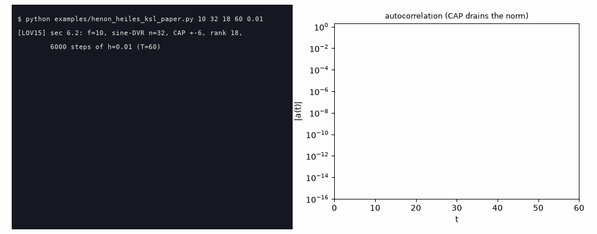
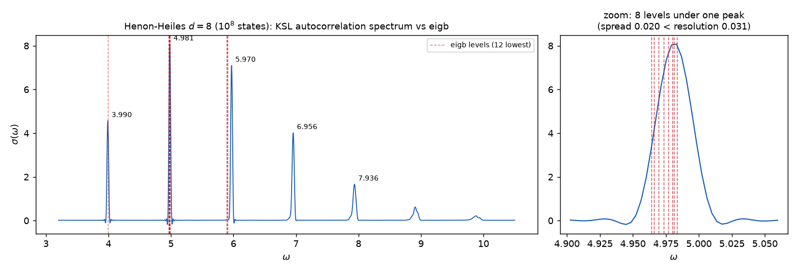
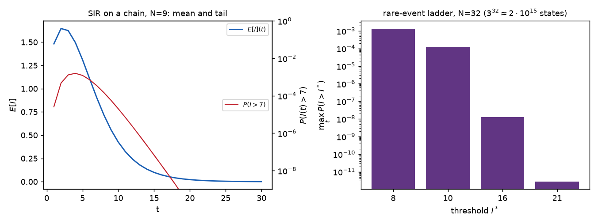
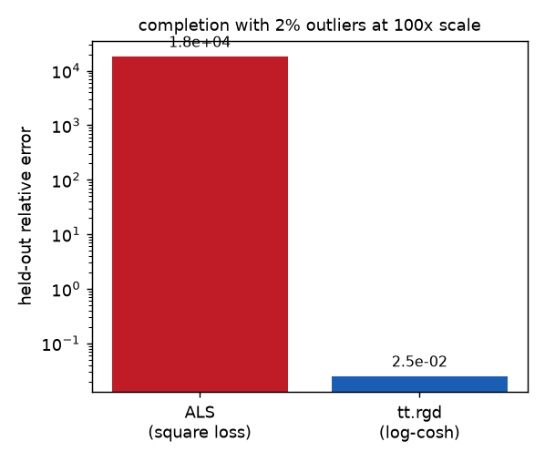
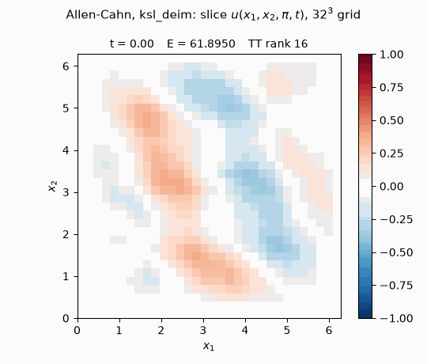
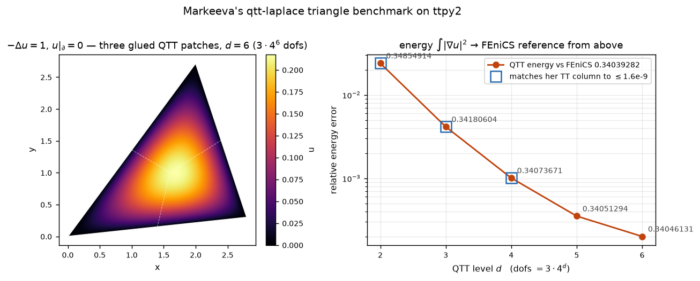

# Examples

Every example is self-contained, runnable from the repository root, and
checked against an oracle that is not this package: an analytic formula, a
dense or sparse rebuild of the same problem, or a published table with the
paper named in the docstring.  The acceptance versions live in
`tests/test_examples.py`.

## Gallery

<table>
<tr>
<td width="50%">
 
<b><a href="pages/qtt_divgrad_cross.md">qtt_divgrad_cross</a></b> (<a href="qtt_divgrad_cross.py">code</a>) — variable-coefficient
diffusion $-\nabla\cdot(k\nabla u)=1$ on a $256^2$ QTT grid: the contrast-100
coefficient sampled at flux faces by TT-cross, solved by <code>amen_solve</code>
with no preconditioner; the animation is the iterate after every sweep.
<i>Oracle: scipy.sparse assembly of the same scheme.</i>
</td>
<td width="50%">
 
<b><a href="pages/henon_heiles_ksl_paper.md">henon_heiles_ksl_paper</a></b> (<a href="henon_heiles_ksl_paper.py">code</a>) — Fig. 3 of
Lubich–Oseledets–Vandereycken (<a href="https://doi.org/10.1137/140976546">SINUM 2015</a>) end to end: the 10-D Hénon–Heiles
spectrum by KSL time integration, sine-DVR, complex absorbing potential;
877 s where the paper reports 4425 s (and 54354 s for MCTDH); the frames
are the run's real log.  The resulting spectrum is
<a href="../docs/media/lov15_fig3.png">here</a>.
<i>Oracle: the paper's own figure; f=2 pinned against dense expm.</i>
</td>
</tr>
<tr>
<td>
 
<b><a href="pages/henon_heiles_spectrum.md">henon_heiles_spectrum</a></b> (<a href="henon_heiles_spectrum.py">code</a>) — the same
spectral method with the eigensolver as the cross-check, at $d=8$ ($10^8$
states, beyond any dense oracle): coherent packet, autocorrelation, windowed
FFT; the ground state agrees with <code>eigb</code> to 4.4e-6 and the
8-fold multiplet at 4.96–4.98 sits under one peak, matching to 5.8e-5.
100 s end to end, eigb's 12 levels in 29 s.
<i>Oracle: eigb on the same operator — two TT methods checking each other
where neither has a dense referee.</i>
</td>
<td>
 
<b><a href="pages/fokker_planck_dumbbell.md">fokker_planck_dumbbell</a></b> (<a href="fokker_planck_dumbbell.py">code</a>) — the polymer
dumbbell in shear flow of Dolgov–Khoromskij–Oseledets (<a href="https://doi.org/10.1137/120864210">SISC 2012</a>):
Crank–Nicolson in TT, Kramers viscometric functions reaching the paper's
Table 3 ($\eta$ 1.03291 vs 1.03281).
<i>Oracles: analytic $\beta=0$ stationary state, sparse propagator, the
$\alpha=0$ Lyapunov solution.</i>
</td>
</tr>
<tr>
<td>
 
<b><a href="pages/sir_network_cme.md">sir_network_cme</a></b> (<a href="sir_network_cme.py">code</a>) — the SIR master equation
on a network (Dolgov–Savostyanov, <a href="https://doi.org/10.1016/j.amc.2023.128290">AMC 2024</a>): the $3^N$-state distribution in
TT, rare-event tails as one dot product with an explicit indicator train —
down to $10^{-12}$, where SSA would need $\sim 5\cdot 10^{13}$ trajectories.
<i>Oracles: brute-force propagator at small N, Gillespie SSA.</i>
</td>
<td>
 
<b><a href="pages/robust_completion.md">robust_completion</a></b> (<a href="robust_completion.py">code</a>) — completion with 2%
outliers at 100x the scale: the square loss (the only one ALS can have)
chases the corruption; Riemannian descent with a log-cosh loss
(<code>tt.rgd</code>, torch autodiff through the tangent parametrization)
recovers the tensor — six orders of magnitude apart on held-out entries.
<i>Oracle: dense ground truth on unobserved entries.</i>
</td>
</tr>
<tr>
<td width="50%">
 
<b><a href="pages/allen_cahn_ksl_deim.md">allen_cahn_ksl_deim</a></b> (<a href="allen_cahn_ksl_deim.py">code</a>) — Dektor's
interpolatory projector-splitting integrator (<code>tt.ksl_deim</code>, ported
from ttpy PR #102) on the 3D Allen–Cahn equation of his paper
(<a href="https://doi.org/10.1016/j.laa.2024.11.001">LAA 2025</a>,
sec. 7.2): the cubic nonlinearity $u-u^3$ is evaluated only on QDEIM-selected
cross fibers — the case the orthogonal-projector KSL cannot afford — with the
paper's Fourier pseudospectral Laplacian as a rank-2 TT-matrix; the animation
is the central slice separating into the $\pm 1$ phases.
<i>Oracle: dense solve_ivp of the same ODE at small n, plus monotone decay of
the Ginzburg–Landau energy along the whole run.</i>
</td>
<td width="50%">
 
<b><a href="pages/sample_dirt_banana.md">sample_dirt_banana</a></b> (<a href="sample_dirt_banana.py">code</a>) — a sample-only
probit bridge from the uniform square to a thin banana: seven low-rank residual
TT densities fitted by orthogonal ALS, with exact TT square integrals and exact
inverse Rosenblatt conditionals.  The same reference cloud sharpens layer by
layer; physical sliced $W_2$ falls from 0.439 to 0.052 (sampling floor 0.025),
using 1,912 parameters in about 1.8 s.
<i>Oracle: the held-out analytic banana density for KL/TV, independent target
samples for sliced Wasserstein, and the exact forward/inverse round trip.</i>
</td>
</tr>
<tr>
<td width="50%">
 
<b><a href="pages/qtt_fem_triangle.md">qtt_fem_triangle</a></b> (<a href="qtt_fem_triangle.py">code</a>) — Poisson on a
triangle, a domain no single tensor-product grid fits: three glued QTT patches,
z-order finite-element assembly with TT-cross Jacobian fields, one
<code>amen_solve</code> on the coupled block train; the energies published with
<a href="https://github.com/RerRayne/qtt-laplace">qtt-laplace</a>
(<a href="https://doi.org/10.1016/j.jcp.2020.109835">JCP 2021</a>) reproduced to 1.5e-9.
<i>Oracle: the FEniCS energy curve shipped in that repository, approached from
above as a Galerkin energy must.</i>
</td>
<td width="50%"></td>
</tr>
</table>

## All examples

| example | what it shows | oracle |
|---|---|---|
| [qtt_divgrad_cross.py](pages/qtt_divgrad_cross.md) ([code](qtt_divgrad_cross.py)) | div–grad assembly by TT-cross, AMEn animation | scipy.sparse rebuild |
| [amen_laplace.py](amen_laplace.py) | the AMEn linear solver on the QTT Laplacian | residual + dense solve |
| [bpx_elliptic.py](bpx_elliptic.py) | BPX preconditioning: $4^d$ conditioning tamed, and why $CAC$ must never be assembled | analytic solution |
| [qtt_fem_triangle.py](pages/qtt_fem_triangle.md) ([code](qtt_fem_triangle.py)) | Poisson on a triangle: three glued QTT patches ([qtt-laplace](https://github.com/RerRayne/qtt-laplace)) | the repository's FEniCS curve + its TT energies |
| [iga_ring.py](iga_ring.py) | isogeometric ring domain in QTT | manufactured solution |
| [ising_integrals.py](ising_integrals.py) | Ising susceptibility integrals $C_m$ by greedy DMRG cross, racing the original Fortran `ttcross` | published values ([Bailey–Borwein–Crandall](https://doi.org/10.1088/0305-4470/39/40/001)) |
| [cross_engines.py](cross_engines.py) | `dmrg_cross` vs `rect_cross` on identical integrands, matched stopping | same integrals |
| [robust_completion.py](pages/robust_completion.md) ([code](robust_completion.py)) | the loss ALS structurally cannot have | dense ground truth |
| [henon_heiles_spectrum.py](pages/henon_heiles_spectrum.md) ([code](henon_heiles_spectrum.py)) | spectra from one trajectory (autocorrelation method) | `eigb` on the same operator |
| [henon_heiles_ksl_paper.py](pages/henon_heiles_ksl_paper.md) ([code](henon_heiles_ksl_paper.py)) | [\[LOV15\]](https://doi.org/10.1137/140976546) Fig. 3, quantum dynamics at paper scale | the paper; dense expm at f=2 |
| [fokker_planck_dumbbell.py](pages/fokker_planck_dumbbell.md) ([code](fokker_planck_dumbbell.py)) | [\[DKO12\]](https://doi.org/10.1137/120864210) sec. 4.2, polymer rheology in TT | three independent oracles |
| [sir_network_cme.py](pages/sir_network_cme.md) ([code](sir_network_cme.py)) | [\[DS24\]](https://doi.org/10.1016/j.amc.2023.128290) epidemics on networks, rare events | brute force + SSA |
| [allen_cahn_ksl_deim.py](pages/allen_cahn_ksl_deim.md) ([code](allen_cahn_ksl_deim.py)) | Dektor's interpolatory KSL (`tt.ksl_deim`) on [his paper's](https://doi.org/10.1016/j.laa.2024.11.001) 3D Allen–Cahn | dense solve_ivp at small n + energy monotonicity |
| [sample_dirt_banana.py](pages/sample_dirt_banana.md) ([code](sample_dirt_banana.py)) | sample-only residual TT transports learned by orthogonal ALS | analytic banana density + independent samples + exact round trip |
