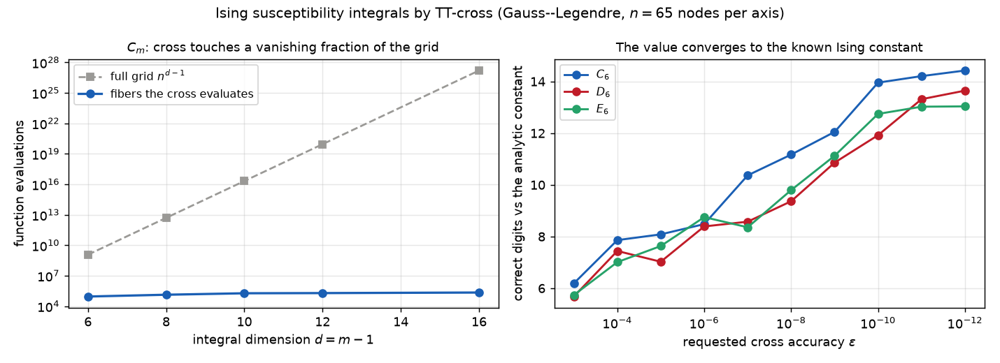

# A high-dimensional integral by TT-cross

Some integrals have no separable form and no product quadrature you could
ever evaluate: the domain is a hypercube of dimension in the dozens, and the
integrand couples every variable to every other.  Cross approximation reaches
them by sampling the integrand along one-dimensional fibers, adaptively
chosen, and reconstructing the whole tensor from those fibers -- so the number
of evaluations grows with the dimension, not with the volume.



## The problem

The benchmark here is the family of **Ising susceptibility integrals** that
appear in the asymptotic expansion of the magnetic susceptibility of the
two-dimensional Ising model.  For dimension $d$ they are integrals over the
unit cube $[0,1]^{d-1}$:

$$
C_d = 2 \int_{[0,1]^{d-1}} B_d\ dx_2 \cdots dx_d, \qquad
D_d = 2 \int_{[0,1]^{d-1}} A_d\ B_d\ dx_2 \cdots dx_d, \qquad
E_d = 2 \int_{[0,1]^{d-1}} A_d\ dx_2 \cdots dx_d,
$$

with the two integrands

$$
A_d = \prod_{1 \le i < j \le d}
      \left(\frac{1 - x_{i+1}\cdots x_j}{1 + x_{i+1}\cdots x_j}\right)^{2},
\qquad
B_d = \left(1 + \sum_{k=2}^{d} x_2 \cdots x_k\right)^{-1}
      \left(1 + \sum_{k=2}^{d} x_k \cdots x_d\right)^{-1}.
$$

Nothing about $A_d$ or $B_d$ separates: every product $x_{i+1}\cdots x_j$
ties a run of variables together.  Yet the discretized integrand, viewed as a
$d-1$ dimensional array of its values on a quadrature grid, turns out to have
**low tensor-train rank** -- and that is exactly what cross approximation
needs.  These integrals are known in closed-ish form to hundreds of digits
(Bailey, Borwein & Crandall), so the computed value has an external referee
at any dimension.

## The code, walked through

Each axis carries a Gauss--Legendre rule on $[0,1]$; the weights are folded
into the integrand, so the integral is a plain sum of the tensor against the
all-ones vector.  The integrand is handed to the cross as a black box that
returns its values at requested multi-indices:

```python
def run(kind, m, n=65, eps=1e-12):
    d = m - 1
    x, w = np.polynomial.legendre.leggauss(n)
    nodes = (x + 1.0) / 2.0
    scale = float(n // 2)
    fun = integrand(kind, m, nodes, (w / 2.0) * scale)
```

`dmrg_cross` builds the tensor-train interpolant, evaluating `fun` only on
the adaptively chosen fibers.  The integral is then one dot product with the
all-ones train:

```python
    y = dmrg_cross(fun, [n] * d, eps=eps)
    val = float(tt.dot(y, tt.ones(n, d))) / scale ** d
```

That is the whole method: sample along fibers, reconstruct, contract.  The
number of evaluations `y.history.fun_eval` and the ranks `y.history.ranks`
are recorded so the run can report what it cost.

## What comes out

At $n = 65$ Gauss--Legendre nodes per axis, `eps = 1e-8`:

| integral | dimension $d$ | full grid $n^{d-1}$ | fibers evaluated | TT rank | value |
|---|---|---|---|---|---|
| $C_6$  | 5  | $1.2\times10^{9}$  | $8.9\times10^{4}$ | 20 | matches $C_6$ to 14 digits |
| $C_{16}$ | 15 | $1.6\times10^{27}$ | $2.2\times10^{5}$ | 15 | matches $C_{16}$ |

The left panel of the figure is this row read across dimension: the full
grid $n^{d-1}$ climbs from $10^{9}$ to $10^{27}$ while the fibers the cross
actually evaluates stay near $10^{5}$ -- a vanishing fraction, and almost
flat in $d$, because the rank of the integrand does not grow with the
dimension.  The right panel is the value itself converging to the published
constant as the cross accuracy tightens: past $\varepsilon = 10^{-10}$ the
$C_6$, $D_6$ and $E_6$ integrals all sit within a few units of the last
double-precision digit of the analytic value.

## Why believe it

The oracle is outside this package and outside the tensor world entirely:
the analytic values of the Ising integrals, known to hundreds of digits from
the work of Bailey, Borwein & Crandall.  The example reports the number of
correct digits against them at every run, and the acceptance tests
(`tests/test_dmrg_cross.py`, and the cross rows of `tests/test_examples.py`)
pin the computed value to those constants and check that the cross touches
far fewer than $n^{d-1}$ nodes.

Two cross engines are available -- `tt.dmrg_cross`, the greedy rank-growing
one used above, and `tt.rect_cross`, built on rectangular maximum-volume
submatrices.  `examples/cross_engines.py` runs both on these integrands if
you want to compare their sampling on your own problem; which one is more
economical depends on the smoothness of the integrand.

## Run it

```bash
python examples/ising_integrals.py            # C_6, C_16, D_6, E_6
python examples/ising_integrals.py d 8 65     # D_8 at 65 nodes per axis
```

## References

* B. Bailey, J. Borwein, R. Crandall, *Integrals of the Ising class*,
  J. Phys. A 39:12271, 2006 -- the integrals and their analytic values.
* I. Oseledets, E. Tyrtyshnikov, *TT-cross approximation for multidimensional
  arrays*, [Linear Algebra Appl. 432, 2010](https://doi.org/10.1016/j.laa.2009.07.024).
* D. Savostyanov, *Quasioptimality of maximum-volume cross interpolation of
  tensors*, [Linear Algebra Appl. 458, 2014](https://doi.org/10.1016/j.laa.2014.06.006).
* S. Dolgov, D. Savostyanov, *Parallel cross interpolation for high-precision
  calculation of high-dimensional integrals*,
  [Comput. Phys. Commun. 246:106869, 2020](https://doi.org/10.1016/j.cpc.2019.106869)
  ([arXiv:1903.11554](https://arxiv.org/abs/1903.11554)) -- the Ising
  integrals as a cross-interpolation benchmark.
