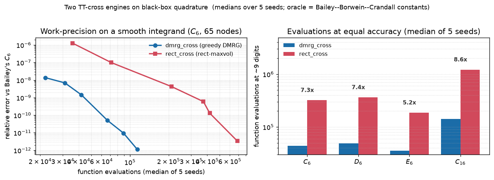

# Two TT-cross engines on one black box: `dmrg_cross` vs `rect_cross`

The package ships two cross-approximation engines, and they are different
algorithms, not one algorithm with different constants. `tt.dmrg_cross` is a
from-scratch port of Savostyanov's greedy DMRG cross; `tt.rect_cross` is an
alternating cross with rectangular-maxvol row selection. This page runs both on
the same black box — the Ising susceptibility integrals of Bailey, Borwein &
Crandall, whose values are known to hundreds of digits — and measures the one
thing that separates them: **function evaluations at equal accuracy**.



## The problem

TT-cross interpolates a black-box tensor from a small number of its entries. You
never form the tensor; you hand cross a function `fun(idx)` that returns entries
at requested multi-indices, and it decides *which* fibers to sample. The engine
that does the sampling is built on the matrix **skeleton** (cross)
approximation: pick $r$ rows $I$ and $r$ columns $J$ of a matrix $A$ and
interpolate

$$A \approx A(:, J)\ A(I, J)^{-1}\ A(I, :).$$

This reproduces $A$ exactly on the chosen rows and columns. Its accuracy is
governed by the volume $|\det A(I, J)|$ of the intersection submatrix: the
**maximum-volume** choice makes the interpolation stable. Concretely, given a
tall factor $Q \in \mathbb{R}^{N \times r}$, `maxvol` finds a row set $I$ that
maximizes $|\det Q(I, :)|$; then the interpolation matrix

$$C = Q\ Q(I, :)^{-1}, \qquad C(I, :) = \mathrm{Id}, \qquad \max_{i, j} |C_{ij}| \le 1,$$

so no sampled fiber is amplified. Chaining this construction across the $d$ bonds
of a tensor train, with nested left sets $I_k$ and right sets $J_k$, gives
TT-cross: the interpolant is exact on every sampled fiber
$I_k \times \{i_k\} \times J_k$, and the error away from the fibers is controlled
by $\sigma_{r+1}$ of the mode unfoldings, up to a polynomial-in-$r$ factor.

The two engines differ in *how the sets grow and where the pivot comes from*:

* **`tt.dmrg_cross`** (alias `tt.greedy_cross`) — the greedy DMRG cross of
  Savostyanov. It works on the two-site superblock, and the rank of each bond
  grows by **at most one per sweep**. The added pivot is the entry of largest
  *residual* $A - \text{col}\cdot\text{row}$, found by a rook search (alternately
  maximize down one column, then along one row) seeded from a random lottery
  over not-yet-chosen entries. That random lottery means exploration is built
  into every pivot search. Built for exactly this use case: expensive smooth
  black boxes, high-dimensional quadrature.
* **`tt.rect_cross`** — one-site alternating cross with rectangular-maxvol row
  selection. Rank grows by `kickrank` per micro-step, and pivots maximize the
  2-volume of an orthonormal basis of the block. It reaches a target rank in far
  fewer sweeps, which is what AMEn-style consumers want.

Because the two `eps` knobs mean different things — a residual-pivot threshold
for the greedy, a sweep-change threshold for the rectangular one — the fair
comparison axis is **digits versus evaluations**, never `eps` versus `eps`.

## The code, walked through

`rect_cross` needs a random rank-2 start; the greedy always starts at rank 1, so
only the rectangular engine is seeded here:

```python
def seeded_start(n, d, seed):
    """A rank-2 random start for ``rect_cross``, seeded for reproducibility."""
    rng = np.random.default_rng(seed)
    cores = [rng.standard_normal((1 if k == 0 else 2, n,
                                  1 if k == d - 1 else 2)) for k in range(d)]
    return vector.from_list(cores)
```

The black box is the discretized Ising integrand from `ising_integrals.py`, its
Gauss–Legendre weights baked into the tensor entries, so the recovered value is a
plain contraction with the all-ones tensor and every printed digit count is
against a constant known to hundreds of digits:

```python
def run(engine, fun, kind, m, n, eps, seed=0):
    d = m - 1
    t0 = time.perf_counter()
    if engine == "dmrg":
        y = dmrg_cross(fun, [n] * d, eps=eps, seed=seed)
    else:
        y = rect_cross(fun, seeded_start(n, d, seed), eps=eps)
    dt = (time.perf_counter() - t0) * 1e3
    val = float(tt.dot(y, tt.ones(n, d))) / float(n // 2) ** d
    h = y.history
    tru = TRUE.get((kind, m))
    digits = ("   n/a" if tru is None else
              f"{-np.log10(max(abs(1.0 - val / tru), 1e-17)):6.2f}")
    print(f"  {engine:5s} eps {eps:7.0e}: digits {digits}  "
          f"evals {h.fun_eval:9d}  rank {max(int(r) for r in y.r):3d}  "
          f"{dt:8.1f} ms")
```

The driver builds the discretized tensor once, warms up the compiler off the
clock, then walks an `eps` ladder for both engines:

```python
d = m - 1
x, w = np.polynomial.legendre.leggauss(n)
fun = integrand(kind, m, (x + 1.0) / 2.0, (w / 2.0) * float(n // 2))
# a throwaway run compiles the integrand and the greedy's bond kernel,
# so the timings below are the algorithms and not the compiler
dmrg_cross(fun, [2] * d, rmax=2, eps=None)

for eps in epss:
    run("dmrg", fun, kind, m, n, eps)
    run("rect", fun, kind, m, n, eps)
```

Every run reports `y.history.fun_eval` — the number of entries the engine
actually asked the black box for — which is the currency this comparison is
denominated in.

## What comes out

Medians over 5 random seeds (the pivot lottery seed for `dmrg_cross`, the
rank-2 start seed for `rect_cross`), 65 Gauss–Legendre nodes per direction, the
same numba-jitted integrand handed to both engines, kernel compile off the
clock:

| problem | engine | eps | median evals | median digits |
|---|---|---|---:|---:|
| $C_6$ ($d=5$)   | `dmrg_cross` | 1e-5 | 31 125  | 8.16  |
|                 | `dmrg_cross` | 1e-9 | 114 057 | 11.95 |
|                 | `rect_cross` | 1e-5 | 71 500  | 7.00  |
|                 | `rect_cross` | 1e-9 | 685 685 | 11.47 |
| $D_6$ ($d=5$)   | `dmrg_cross` | 1e-9 | 95 989  | 10.72 |
|                 | `rect_cross` | 1e-9 | 712 790 | 10.79 |
| $E_6$ ($d=5$)   | `dmrg_cross` | 1e-9 | 72 451  | 11.05 |
|                 | `rect_cross` | 1e-9 | 392 730 | 10.87 |
| $C_{16}$ ($d=15$) | `dmrg_cross` | 1e-5 | 85 751    | 8.00  |
|                 | `dmrg_cross` | 1e-9 | 344 521   | 11.27 |
|                 | `rect_cross` | 1e-5 | 306 865   | 6.86  |
|                 | `rect_cross` | 1e-9 | 2 177 175 | 11.40 |

Reading the same runs as **evaluations at a common target of ~9 digits**
(interpolated from each engine's median work-precision curve) is the right panel
of the figure:

| problem | `dmrg_cross` evals | `rect_cross` evals | ratio |
|---|---:|---:|---:|
| $C_6$    | 44 049  | 321 010   | **7.3x** |
| $D_6$    | 49 266  | 363 387   | **7.4x** |
| $E_6$    | 35 652  | 186 656   | **5.2x** |
| $C_{16}$ | 142 293 | 1 217 570 | **8.6x** |

On these smooth quadrature tensors the greedy needs **5–9x fewer function
evaluations** at equal accuracy, and at every `eps` it lands a fraction of a
digit above `rect_cross` for its budget. The left panel says the same thing as a
work-precision plot: the `dmrg_cross` curve sits below and to the left of
`rect_cross` at every accuracy on $C_6$. Both engines top out near 14 digits on
these tensors — the ceiling is float64, not the method.

## Three claims that died on the medians

Getting to these numbers meant retracting three single-shot claims. They are
recorded here because they are exactly the kind of thing best-of-N timing and one
lucky seed will tell you, and the medians will not.

1. **"The numpy engine is 8–14% faster than the Fortran per evaluation."** That
   came from best-of-5 wall-clock timings against best-of-3. Over 7 seeds the
   spread swallows it: the evaluation schedules and the delivered digits are
   **statistically identical** to the reference Fortran `ttcross`, medians
   differing by under 0.15%. The honest statement is **parity of schedules**, not
   a per-evaluation win. (The real speed win is elsewhere — see below.)
2. **"`dmrg_cross` gets +2.9 digits on $C_{16}$."** One lucky start seed. The
   per-seed spread on that problem runs from 11.4 to 14.1 digits at the same
   budget; the median gain over `rect_cross` is a fraction of a digit, not three.
3. **"5–40x fewer evaluations."** The 40x end was a rare early strike-out of the
   Fortran reference's always-armed accuracy rule under its unseeded lottery — an
   atypical cheap run, not its cost. Measured against `rect_cross` over 5 seeds,
   the real spread at equal accuracy is the **5–9x** in the table above (the plan
   document, which also folds in problems with flatter spectra, quotes it as
   3–7x, typically ~6x).

What survives the medians is sturdier than any of the three: **parity of the
evaluation schedules** with the Fortran original (the port reproduces its counts
to the evaluation on $C_6$), a real **win in the number of evaluations** on
smooth black boxes, and a **compiled path 1.6–2.0x faster than the Fortran** per
evaluation (`tt/algs/_dmrg_fast.py`, engaged automatically when `fun` is a numba
dispatcher).

**When to reach for which.** Smooth, expensive, quadrature-style black box where
you pay per evaluation → `dmrg_cross`: its +1-per-sweep growth with residual rook
pivoting spends the fewest calls. A flat or predictable rank spectrum where you
want to hit a target rank in a handful of sweeps (AMEn-style consumers) →
`rect_cross`: its `kickrank`-sized jumps get there faster. The two are not
ranked; they answer different questions.

## Why believe it

* The oracle is not this package. Every digit count is $-\log_{10}$ of the
  relative error against **Bailey–Borwein–Crandall's published constants**
  (`TRUE` in `ising_integrals.py`), which are known to hundreds of digits — a
  reference wholly outside the tensor code.
* `tests/test_dmrg_cross.py` — 18 acceptance tests for the greedy engine —
  pins it against **dense-tensor truth** and **closed-form** oracles (a known
  Vandermonde-style tensor, a separable product with a known cross rank), so the
  engine is checked where the exact answer is computable independently.
* `tests/test_examples.py` pins the cross examples end to end: the greedy
  Ising driver reproduces the published constants, and
  `test_divgrad_cross_assembly_matches_scipy_sparse` exercises the cross path on
  a smooth 2-D coefficient against a `scipy.sparse` rebuild.
* The measured parity with the reference Fortran `ttcross` (evaluation counts
  matched to the evaluation on $C_6$: 8 205 and 26 315 exactly at matched rank
  caps) is documented in `docs/plans/cross-approximation.md` §2.1b.

## Run it

```bash
python examples/cross_engines.py                # C_6, three accuracies, both engines
python examples/cross_engines.py c 16           # a harder one: C_16
python examples/cross_engines.py e 6 129 1e-9   # kind, index, quadrature size, eps
python examples/ising_integrals.py              # C_6, C_16, D_6, E_6 by dmrg_cross alone
```

The figure on this page is regenerated by a measurement script that runs both
engines over 5 seeds per `eps` and plots the medians.

## References

* I. V. Oseledets, E. E. Tyrtyshnikov — TT-cross approximation for
  multidimensional arrays, *Linear Algebra Appl.* 432(1):70–88, 2010
  ([doi:10.1016/j.laa.2009.07.024](https://doi.org/10.1016/j.laa.2009.07.024)) —
  the cross idea `rect_cross` descends from.
* D. V. Savostyanov — Quasioptimality of maximum-volume cross interpolation of
  tensors, *Linear Algebra Appl.* 458:217–244, 2014
  ([doi:10.1016/j.laa.2014.06.006](https://doi.org/10.1016/j.laa.2014.06.006)) —
  the greedy DMRG cross `dmrg_cross` ports.
* A. Mikhalev, I. V. Oseledets — Rectangular maximum-volume submatrices and
  their applications, *Linear Algebra Appl.* 538:187–211, 2018
  ([doi:10.1016/j.laa.2017.10.014](https://doi.org/10.1016/j.laa.2017.10.014)) —
  `rect_cross`'s pivot rule.
* D. H. Bailey, J. M. Borwein, R. E. Crandall — Integrals of the Ising class,
  *J. Phys. A* 39:12271, 2006
  ([doi:10.1088/0305-4470/39/40/001](https://doi.org/10.1088/0305-4470/39/40/001))
  — the black box and its reference constants.
