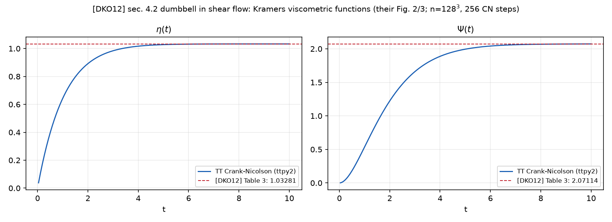

# The polymer dumbbell in shear flow: [DKO12] section 4.2 in TT

A three-dimensional Fokker–Planck equation for a polymer dumbbell in shear
flow, assembled *exactly* in TT and propagated by Crank–Nicolson with
`amen_solve`, reproducing the viscometric functions of Table 3 of
Dolgov–Khoromskij–Oseledets (SISC 2012) — with three oracles the paper did
not have.



## The problem

A polymer dumbbell — two beads and one spring — sits in a shear flow.  The
configuration distribution $\psi(q, t)$, $q = (x, y, z)$, solves the
Fokker–Planck equation ([DKO12] eq. (9)):

$$
\frac{\partial \psi}{\partial t} = -\mathcal{A}\psi,
\qquad
\mathcal{A}\psi = -\epsilon \, \Delta \psi + \nabla \cdot (\psi \, v),
\qquad
v = K q - \tfrac{1}{2}\nabla\phi,
\qquad \epsilon = \tfrac{1}{2},
$$

with the shear-flow velocity gradient

$$
K = \beta \, e_1 e_2^{T}
$$

(only the entry $K_{12} = \beta$ is nonzero: the $x$-velocity grows linearly
in $y$), and the potential combining a Hookean spring with a bead–bead
repulsion,

$$
\phi(q) = \frac{|q|^2}{2} + \frac{\alpha}{p^3} \exp\!\left(-\frac{|q|^2}{2p^2}\right),
$$

with $\beta = 1$, $\alpha = 0.1$, $p = 0.5$ on $[-10, 10]^3$ — the setup of
[DKO12] section 4.2, verbatim.  The physics is read off through the Kramers
expression

$$
\tau_{ij}(t) = \int \psi(q, t)\, q_i \, \frac{\partial \phi}{\partial q_j} \, dq,
\qquad
\eta = \frac{\tau_{12}}{\beta},
\qquad
\Psi = \frac{\tau_{11} - \tau_{22}}{\beta^2},
$$

where $\eta$ is the polymer contribution to viscosity and $\Psi$ the first
normal-stress coefficient.  The paper's converged values at $T = 10$ are
$\eta = 1.03281$, $\Psi = 2.07114$ (its Table 3, boldface digits) — the
external reference this example reports against.

A word on signs, because the paper's eq. (18) carries minus signs in front
of both ratios.  The unambiguous anchor is the pure Hookean case
$\alpha = 0$, where the stationary covariance solves a $3 \times 3$ Lyapunov
equation by hand:

$$
\langle q_1 q_2 \rangle = \beta,
\qquad
\langle q_1^2 \rangle - \langle q_2^2 \rangle = 2\beta^2,
$$

so with the literal $\tau$ above, $\tau_{12}/\beta = 1$ and
$(\tau_{11} - \tau_{22})/\beta^2 = 2$ *exactly*, for every $\beta$, matching
the positive values the paper reports (the repulsion at $\alpha = 0.1$ moves
them by ~3%).  The paper's minus signs belong to its own stress-tensor sign
convention, not to this integral.

## The code, walked through

**The operator is assembled exactly — no cross approximation touches it.**
Every term of the drift $v$ is separable: with
$g(t) = \exp(-t^2/(2p^2))$ and $c = \alpha/(2p^5)$,

$$
v_1 = \beta y - \tfrac{x}{2} + c\, x\, g(x)g(y)g(z),
\qquad
v_2 = -\tfrac{y}{2} + c\, y\, g(x)g(y)g(z),
\qquad
v_3 = -\tfrac{z}{2} + c\, z\, g(x)g(y)g(z),
$$

so the whole operator is a short sum of Kronecker products of 1D matrices —
each a rank-1 TT-matrix built by `_mat3` — with total TT rank $\le 8$ after
rounding:

```python
    terms = [
        _mat3([-EPS_DIFF * lap1, I, I]),
        _mat3([I, -EPS_DIFF * lap1, I]),
        _mat3([I, I, -EPS_DIFF * lap1]),
        # div(psi v): d/dx (v1 psi) + d/dy (v2 psi) + d/dz (v3 psi)
        _mat3([C @ (-0.5 * dx_), I, I]),
        _mat3([I, C @ (-0.5 * dx_), I]),
        _mat3([I, I, C @ (-0.5 * dx_)]),
        _mat3([c * (C @ (dx_ @ dg)), dg, dg]),
        _mat3([dg, c * (C @ (dx_ @ dg)), dg]),
        _mat3([dg, dg, c * (C @ (dx_ @ dg))]),
    ]
    if beta != 0.0:
        terms.append(_mat3([beta * C, dx_, I]))   # d/dx (beta y psi)
    A = terms[0]
    for m in terms[1:]:
        A = A + m
    return A.round(1e-13), x, h
```

Here `lap1` is the second-order Dirichlet Laplacian on $n$ interior points
of $[-10, 10]$, `C` the central first difference, `dg` and `dx_` the
diagonal matrices of $g(x)$ and $x$.  The `.round(1e-13)` compresses the ten
rank-1 terms down to the true operator rank — a lossless compression at that
tolerance, which is why the tests can demand operator parity at the
$10^{-10}$ level against a `scipy.sparse` rebuild.

**The Kramers weights are explicit rank-2 tensors** — since
$\partial_j \phi = q_j\,(1 - (\alpha/p^5)\, g(x)g(y)g(z))$, every weight is
a product of univariate factors minus a rank-1 correction:

```python
    w[(1, 1)] = _vec3([x * x, one, one]) - c * _vec3([x * x * g, g, g])
    w[(2, 2)] = _vec3([one, x * x, one]) - c * _vec3([g, x * x * g, g])
    w[(1, 2)] = _vec3([x, x, one]) - c * _vec3([x * g, x * g, g])
```

so every stress component is one TT dot product times $h^3$.

**Time stepping is Crank–Nicolson with a warm-started `amen_solve`.**  The
matrices $M_\pm = I \pm \frac{\tau}{2}\mathcal{A}$ are built once; every
step solves $M_{+}\psi^{k+1} = M_{-}\psi^{k}$ with the previous snapshot as
the initial guess, and the integral is renormalized — a solve-and-round
scheme conserves $\int \psi = 1$ only to the solver accuracy:

```python
    for k in range(nsteps):
        rhs = tt.matvec(M_minus, psi).round(1e-10)
        psi = amen_solve(M_plus, rhs, psi, eps_amen, verb=0)
        # renormalize: CN conserves integral only up to solver accuracy
        psi = psi * (1.0 / (tt.sum(psi) * h ** 3))
```

The warm start matters: near the stationary state the previous snapshot is
already an excellent guess, and the AMEn sweeps terminate early.

## What comes out

At the paper's resolution — $n = 256$ points per axis, i.e. a $256^3$ grid,
256 CN steps to $T = 10$ — the run takes about 30 minutes with TT ranks
staying $\le 28$, and lands on the paper's Table 3 to four digits:

| quantity | this example ($n = 256^3$) | [DKO12] Table 3 |
|---|---|---|
| $\eta(T)$ | 1.03291 | 1.03281 |
| $\Psi(T)$ | 2.07251 | 2.07114 |

At $\beta = 0$ the drift is a potential field and the stationary solution is
analytic, $\psi_* = C e^{-\phi}$; the distance
$\Vert \psi(T) - \psi_* \Vert / \Vert \psi_* \Vert$ of the propagated
solution from it is pure $O(h^2)$ discretization error — $T$-independent,
falling exactly $4\times$ per grid doubling:

| $n$ per axis | 64 | 128 | 256 |
|---|---|---|---|
| residual | 9.9e-3 | 2.5e-3 | 6.3e-4 |

That is the shape of a residual dominated by the scheme, not by solver error
or unfinished relaxation.

## Why believe it

Three independent oracles, none of which the paper had:

* **A sparse propagator with no tensor format anywhere.**
  `tests/test_examples.py::test_fokker_planck_dumbbell_matches_a_sparse_propagator`
  rebuilds the same Crank–Nicolson scheme at $n = 32$ from `scipy.sparse`
  Kronecker products, LU-factorized once, and pins the TT path against it:
  the TT operator is *exact* (parity below $10^{-10} \Vert A \Vert$ on a
  random vector), the propagated states agree to $10^{-6}$, and the Kramers
  stress — the physical output — agrees to the same accuracy.
* **The analytic $\beta = 0$ stationary state.**
  $e^{-\phi} = e^{-|q|^2/2} \exp(-(\alpha/p^3)\, g(x)g(y)g(z))$ is an
  exponential of a rank-1 function, smooth and of small TT rank;
  `tt.dmrg_cross` builds it to $10^{-10}$ from pointwise values and the
  propagated solution converges to it at the $O(h^2)$ rate above.
* **The $\alpha = 0$ Lyapunov solution** anchors the stress signs: the
  hand-computable stationary covariance gives $\tau_{12}/\beta = 1$ and
  $(\tau_{11} - \tau_{22})/\beta^2 = 2$ exactly, resolving the sign
  ambiguity of the paper's eq. (18) without appeal to convention.

## Run it

```
python examples/fokker_planck_dumbbell.py             # the paper setup (n=256, ~30 min)
python examples/fokker_planck_dumbbell.py 256 256     # grid n, time steps
python examples/fokker_planck_dumbbell.py 256 256 0   # ... and beta=0 (analytic oracle)
```

The acceptance version is
`tests/test_examples.py::test_fokker_planck_dumbbell_matches_a_sparse_propagator`.

## References

* S. V. Dolgov, B. N. Khoromskij, I. V. Oseledets, "Fast solution of
  multi-dimensional parabolic problems in the tensor train/quantized tensor
  train format with initial application to the Fokker-Planck equation",
  SIAM J. Sci. Comput. 34(6):A3016–A3038, 2012 [DKO12].
* G. Venkiteswaran, M. Junk, "A QMC approach for high dimensional
  Fokker-Planck equations modelling polymeric liquids", Math. Comput.
  Simul. 68:43–56, 2005 — the model and the repulsion potential.
