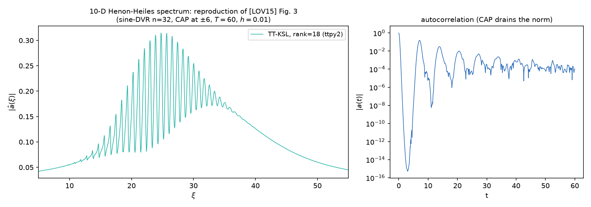

# The 10-D Hénon–Heiles spectrum at paper scale

[`examples/henon_heiles_ksl_paper.py`](../henon_heiles_ksl_paper.py) reproduces Fig. 3 of Lubich–Oseledets–Vandereycken (SINUM 2015) end to end — the vibrational spectrum of the 10-dimensional Hénon–Heiles Hamiltonian by fixed-rank TT-KSL time integration, at the paper's full scale.




## The problem

The time-dependent Schrödinger equation

$$i \frac{\partial\psi}{\partial t} = H\psi, \qquad H = -\frac{1}{2}\Delta + \frac{1}{2}\sum_{k=1}^{f} q_k^2 + \lambda \sum_{k \lt f} \left(q_k^2  q_{k+1} - \frac{q_{k+1}^3}{3}\right), \qquad \lambda = 0.111803,$$

with $f = 10$ degrees of freedom and the initial packet a product of shifted Gaussians $\prod_k e^{-(q_k-2)^2/2}$ — the experiment of section 6.2 of [LOV15], verbatim, which in turn is the MCTDH benchmark of Nest and Meyer.

The observable is not the state but its **autocorrelation**

$$
a(t) = \langle \psi(t), \psi(0) \rangle .
$$

If $\psi(0) = \sum_l c_l \phi_l$ in the eigenbasis of $H$, then $a(t) = \sum_l |c_l|^2  e^{-i\lambda_l t}$: a sum of pure oscillations at exactly the eigenvalues the packet overlaps. Its Fourier transform

$$
|\hat a(\xi)| = \left|\int_0^T a(t)  e^{i\xi t}  dt\right|
$$

therefore peaks at those eigenvalues — the vibrational spectrum à la MCTDH, from one trajectory, which is what Fig. 3 of the paper shows.

Three pieces make the discretized problem:

* **Sine-DVR** (Colbert–Miller): each coordinate is discretized by $n = 32$ interior points of a particle-in-a-box sine basis on $[-9, 9]$. The kinetic matrix is dense but exact in this basis; every function of $q$ is diagonal on the grid — which is what makes the potential (and the CAP below) a cheap MPO. The paper does not state its DVR interval; $[-9,9]$ is recorded as this reproduction's choice, and the spectrum is insensitive to it as long as the absorber has room to act.
* **Complex absorbing potential (CAP).** The Hamiltonian is made non-Hermitian by the cubic absorber of the paper,

  $$
  W(q) = i \eta \sum_k \left((q_k - 6)_+^3 + (q_k + 6)_-^3\right), \qquad \eta = -1,
  $$

  which ramps on over the outer 3 units on each side and eats the outgoing flux instead of letting it wrap around the box. Under $e^{-iHt}$ this drains the norm — visibly, in the log.
* **Strang-KSL.** The propagator is the second-order (Strang) projector-splitting KSL integrator on the fixed-rank-18 TT manifold, time step $h = 0.01$ up to $T = 60$; each step is a KSL sweep with $\tau = -i h$, which promotes the whole sweep to complex128.

## The code, walked through

The sine-DVR grid and kinetic matrix are the Colbert–Miller formulas, nothing more:

```python
def sine_dvr(n, a, b):
    n = int(n)
    L = float(b - a)
    j = np.arange(1, n + 1)
    x = a + j * L / (n + 1)
    T = np.empty((n, n))
    pref = np.pi ** 2 / (4.0 * L ** 2)
    for r_ in range(1, n + 1):
        for c in range(1, n + 1):
            if r_ == c:
                T[r_ - 1, c - 1] = pref * ((2.0 * (n + 1) ** 2 + 1) / 3.0
                                           - 1.0 / np.sin(np.pi * r_ / (n + 1)) ** 2)
            else:
                T[r_ - 1, c - 1] = pref * (-1.0) ** (r_ - c) * (
                    1.0 / np.sin(np.pi * (r_ - c) / (2.0 * (n + 1))) ** 2
                    - 1.0 / np.sin(np.pi * (r_ + c) / (2.0 * (n + 1))) ** 2)
    return x, T
```

A transcription bug in that double loop would poison everything downstream, so the matrix is checked **on the spot, in every run**, before any propagation: the harmonic levels on this grid must come out at $k + \tfrac12$.

```python
    x, T = sine_dvr(n, a, b)
    # the on-the-spot check: harmonic levels on this grid must be k + 1/2
    ho = np.linalg.eigvalsh(T + 0.5 * np.diag(x ** 2))
    worst = np.abs(ho[:10] - (np.arange(10) + 0.5)).max()
    # 32 points on 18 units of interval carry the first ten levels to ~4e-4 --
    # three orders below the 2 pi / T spectral resolution; a formula bug would
    # show as O(1) here, which is what the check is for
    if worst > 1e-3:
        raise RuntimeError(...)
```

The CAP folds the paper's sign convention in, so that a positive `eta` always means absorption:

```python
def cap(x, eta=CAP_ETA, edge=CAP_EDGE):
    """``-i eta ((q-6)_+^3 + (-6-q)_+^3)``: absorbing under ``exp(-iHt)``."""
    ramp = np.maximum(x - edge, 0.0) ** 3 + np.maximum(-edge - x, 0.0) ** 3
    return -1j * eta * ramp
```

The Hamiltonian is a rank-3 complex MPO. The nearest-neighbour coupling $q_k^2 q_{k+1}$ is the textbook three-band pattern: identity above, one-site terms flowing into the corner, $\lambda Q^2$ handing off to $Q$ on the next site. The CAP and the cubic $-\lambda q^3/3$ terms ride on the diagonal one-site slot:

```python
    h1 = T + 0.5 * np.diag(x ** 2) + np.diag(cap(x))
    Q1 = np.diag(x)
    Q2 = np.diag(x ** 2)
    Q3 = np.diag(x ** 3)
    I = np.eye(n)
    cores = []
    for k in range(f):
        W = np.zeros((3, 3, n, n), dtype=complex)
        W[2, 2] = I
        W[0, 0] = I
        W[2, 0] = h1 - (lam / 3.0) * Q3 if k > 0 else h1
        W[2, 1] = lam * Q2
        W[1, 0] = Q1
        c = np.transpose(W, (0, 2, 3, 1))
        if k == 0:
            c = c[2:3]
        if k == f - 1:
            c = c[:, :, :, 0:1]
        cores.append(np.ascontiguousarray(c))
    return tt.matrix.from_list(cores), x
```

The initial packet is exactly rank 1, and KSL keeps ranks fixed — it cannot grow a rank-1 start. So the packet is padded to the manifold rank with $10^{-8}$ random noise:

```python
    rng = np.random.default_rng(seed)
    noise = tt.rand([n] * f, r=r, samplefunc=rng.standard_normal)
    noise = noise * (1e-8 / noise.norm())
    y = (psi0 + noise).round(0.0, rmax=r)
```

The propagation loop is one KSL sweep per step with $\tau = -ih$, recording one dot product per step. The `use_normest=2` flag is a measured decision, not a default:

```python
        for k in range(nsteps):
            # use_normest=2: skip the power-iteration guess of ||B|| (4 extra
            # operator applications per local exponential).  It only seeds the
            # first Krylov substep, and at tau ||B|| << 1 the whole step is one
            # substep anyway -- measured 25% of the wall time on this problem.
            y = ksl(A, y, -1j * h, verb=0, check_rank=False, use_normest=2)
            acorr[k + 1] = tt.dot(psi0, y)
```

At the local block sizes of this run the exponentials go through the package's EXPOKIT-style Krylov substepping (`expmv_krylov`) at relative accuracy $10^{-8}$ — the same algorithm and tolerance the paper takes from Expokit itself. (The compiled complex128 KSL kernels of `tt/algs/_ksl_fast.py` — see `docs/PERFORMANCE.md` § 3b — cover the small-block exact-exponential regime; blocks this size take the interpreted Krylov path.)

Finally the transform of Fig. 3, zero-padded 8× for a smooth plot ( `ifft` carries the $e^{+i\xi t}$ sign that turns $e^{-i\lambda t}$ autocorrelations into peaks at $+\lambda$):

```python
    # |a^(xi)| = |integral_0^T a(t) exp(i xi t) dt|, the transform of Fig. 3
    tgrid = np.arange(nsteps + 1) * h
    M = 8 * len(acorr)
    spec = np.abs(np.fft.ifft(acorr, M) * M * h)
    xi = 2.0 * np.pi * np.arange(M // 2) / (M * h)
```

## What comes out

The GIF above is the run's real log, and its numbers are the result:

* **6000 KSL steps** at $f = 10$ and rank 18, carried entirely in the TT format — the full paper-scale problem, about 15 minutes on 8 cores (110–155 ms/step).
* The norm decays monotonically from 1 to **0.5913** at $T = 60$ (0.9098 at $t=5$, 0.7531 at $t=25$, …): the CAP is absorbing, exactly as the non-Hermitian $H$ says it must.
* $|a(t)|$ recurs in decaying bursts and settles near $10^{-4}$; its transform is the comb of sharp peaks under an envelope with its maximum near $\xi \approx 25$ (peak height $|\hat a| \approx 0.31$) — the shape of Fig. 3 of the paper.

## Why believe it

* **The DVR is checked in every run**: the first ten harmonic levels on this grid come out within $\sim 4\times 10^{-4}$ of $k + \tfrac12$ (gate at $10^{-3}$; a formula bug would show as $O(1)$).
* **The whole machinery is pinned against a dense propagator at $f = 2$** — `tests/test_examples.py::test_ksl_paper_setup_matches_dense_propagation`. The same `hamiltonian`/`packet`/`ksl` pipeline at $f=2$, $n=32$, rank 12 is run head-to-head against `scipy.linalg.expm(-1j * h * H)` on the full 1024-dimensional state. The *state* (not a summary number) has to track the dense flow: after the first 50 steps the error is the integrator's own, about $10^{-7}$ (asserted below $10^{-5}$); at $T = 3$ the accumulated rank-12 modelling error stays below $2\times 10^{-3}$. The test also asserts $\|\psi\| \lt 1 - 10^{-6}$ at $T=3$: the CAP must have started absorbing — a Hermitian-by-mistake $H$ would conserve the norm to $10^{-12}$.
* **The paper's own Fig. 3** is the external oracle for the full $f=10$ run.

## Run it

```console
$ python examples/henon_heiles_ksl_paper.py                # the paper setup
$ python examples/henon_heiles_ksl_paper.py 10 32 18 60 0.01
                                           # f, DVR size, rank, T, step h
$ python examples/henon_heiles_ksl_paper.py 10 32 18 60 0.01 out.npz   # save
```

The paper setup is 6000 KSL steps, about 15 minutes on 8 cores in the recorded run. The acceptance test is fast:

```console
$ pytest tests/test_examples.py::test_ksl_paper_setup_matches_dense_propagation
```

(~2 s together with the spectrum-transform test on a Mac laptop.)

## References

* C. Lubich, I. V. Oseledets, B. Vandereycken, "Time integration of tensor trains", SIAM J. Numer. Anal. 53(2):917–941, 2015, arXiv:1407.2042 **[LOV15]** — section 6.2 and Fig. 3.
* D. T. Colbert, W. H. Miller, J. Chem. Phys. 96:1982–1991, 1992 — the sine-DVR kinetic energy matrix.
* M. Nest, H.-D. Meyer, J. Chem. Phys. 117:10499–10505, 2002 — the MCTDH benchmark this model comes from, including the CAP.
