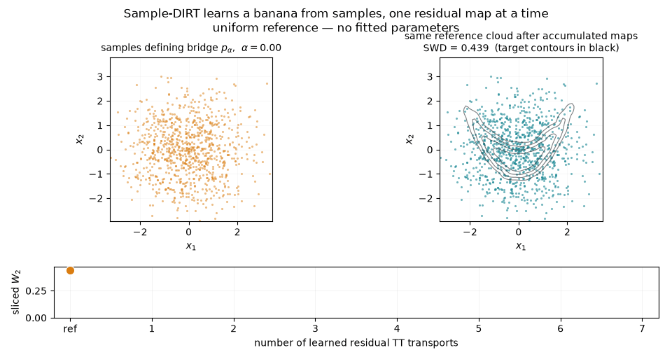

# Seven low-rank residual TT maps learn a banana from samples

The same 20,000 endpoint observations are re-noised into seven increasingly sharp bridge distributions.  At every bridge point, Sample-DIRT fits one residual density in TT form by orthogonal full-batch ALS and appends its exact inverse Rosenblatt map.  No target-density value or gradient is used during training.



The animation follows one fixed uniform reference cloud.  Its left panel is the sample-only bridge presented to the current layer; the right panel is the reference cloud after all maps fitted so far, with independent target-sample contours in black.  The bottom trace is sliced $W_2$ in the original physical coordinates.

## The sample-only problem

The two-dimensional target is generated from independent $Z_1,Z_2\sim\mathcal N(0,1)$ by

$$
X_1 = 1.05 Z_1,
\qquad
X_2 = 0.32 Z_2 + 0.52\bigl(Z_1^2-1\bigr).
$$

The nonlinear term bends a thin conditional Gaussian into the banana visible above.  Sample-DIRT works on the unit square, so the example uses the smooth probit chart

$$
U = \Phi\left(X\oslash(1.25,1.15)\right) \in (0,1)^2.
$$

The training routine receives only samples of $U$.  The triangular construction above, and therefore the normalized analytic density, is kept outside the fit and used only for the final KL/TV oracle.

The relevant code is deliberately short:

```python
def banana_samples(count, rng):
    latent = rng.standard_normal((count, 2))
    physical = np.column_stack([
        1.05 * latent[:, 0],
        0.32 * latent[:, 1] + 0.52 * (latent[:, 0] ** 2 - 1.0),
    ])
    return ndtr(physical / SCALE)
```

## A diffusion bridge available from endpoint samples

If $U_\star$ is a target sample and $\varepsilon\sim\mathcal N(0,I)$ is fresh noise, define

$$
Z_\alpha
= \alpha \Phi^{-1}(U_\star)
+ \sqrt{1-\alpha^2} \varepsilon,
\qquad
U_\alpha = \Phi(Z_\alpha).
$$

At $\alpha=0$, $U_0$ is exactly uniform; at $\alpha=1$, $U_1=U_\star$.  Thus every intermediate law can be sampled without evaluating a density:

```python
latent = ndtri(np.clip(target, eps, 1.0 - eps))
bridge = ndtr(alpha * latent
              + np.sqrt(1.0 - alpha * alpha) * rng.standard_normal(latent.shape))
```

This run uses

$$
\alpha=(0.20,0.40,0.60,0.78,0.90,0.97,1.00).
$$

The count `140000 bridge observations` in the output is therefore not 140,000 target-oracle calls.  It is seven independent re-noisings of the same 20,000 stored endpoints.

## What one TT layer learns

Let $T_{\ell-1}$ be the accumulated inverse Rosenblatt transport before layer $\ell$, and pull the next bridge samples back to its residual coordinates,

$$
Y_\ell = T_{\ell-1}^{-1}(U_{\alpha_\ell}).
$$

If $p_\ell$ is the density of $Y_\ell$ relative to the uniform measure $\mu$ on the square, write its correction as $p_\ell=1+a_\ell$.  The population objective used by the example is

$$
\mathcal J_\ell(a)
= \frac12 \mathbb E_\mu[a^2]
- \mathbb E_{Y_\ell}[a]
+ \mathbb E_\mu[a].
$$

Completing the square shows that its unconstrained minimizer is exactly

$$
a_\ell^\star = p_\ell-1.
$$

Only the middle term is empirical.  For the cellwise TT representation, both uniform expectations are exact tensor contractions — in particular, the integral of the squared TT is not Monte Carlo estimated.

On an $n_1\times n_2$ grid the correction is

$$
a[i,j]
= \sum_{\beta=1}^{r}
G_1[1,i,\beta]G_2[\beta,j,1].
$$

Fixing either core makes $\mathcal J_\ell$ a quadratic least-squares problem in the other.  A forward/backward ALS sweep solves those local systems and moves the orthogonality centre after every update.  The orthogonal gauge makes the uniform-measure left and right Gram environments identities, avoiding their repeated reconstruction and keeping the local systems well scaled.

The call used at every layer is:

```python
history = model.fit_layer(
    bridge,
    estimator="centered",
    modes=modes,
    rank=rank,
    optimizer="als",
    epochs=10,
    initialization_coarse_bins=4,
    projection_rank=rank,
    representation="direct",
    seed=seed + level - 1,
)
```

Early stopping selected four to six sweeps per layer in the recorded run.

## From a fitted density to a transport

For each fitted residual density $1+a_\ell$, the package contracts TT suffixes to obtain every conditional cell mass.  Hence its Rosenblatt CDF is piecewise linear and its inverse is computed exactly cell by cell, without a learned inverse network or a numerical multidimensional integral.

Writing $R_\ell$ for this residual Rosenblatt map, the accumulated generative transport is

$$
T_0=I,
\qquad
T_\ell = T_{\ell-1}\circ R_\ell^{-1}.
$$

This composition order is why the animation can send the *same* uniform points through every checkpoint: changes in the cloud show only what the newly appended correction contributes.

The resolution and rank grow only when the bridge becomes sharp:

| layer | $\alpha$ | grid | TT rank | layer parameters | physical SWD |
|---:|---:|---:|---:|---:|---:|
| 1 | 0.20 | $20^2$ | 2 | 80 | 0.439 |
| 2 | 0.40 | $24^2$ | 3 | 144 | 0.409 |
| 3 | 0.60 | $28^2$ | 3 | 168 | 0.348 |
| 4 | 0.78 | $32^2$ | 4 | 256 | 0.261 |
| 5 | 0.90 | $36^2$ | 4 | 288 | 0.163 |
| 6 | 0.97 | $40^2$ | 5 | 400 | 0.085 |
| 7 | 1.00 | $48^2$ | 6 | 576 | 0.052 |

The total is 1,912 stored scalar parameters.  A dense sum of these seven grids would contain 7,984 cells; the TT parameterization is about four times smaller even in two dimensions, where compression is least dramatic.

## What comes out

The deterministic default run (`seed=731`) reports:

```text
unique target samples       20,000
fit time                    1.8 s  (CPU, development laptop)
stored parameters           1,912
sliced W2: reference        0.4395
sliced W2: Sample-DIRT      0.0515
two-target sampling floor   0.0252
KL(target || model)         0.1388
TV(target, model)           0.1337 ± 0.0008
round-trip max error        5.6e-16
```

The sliced-Wasserstein floor is measured between two independent target clouds of the same size.  The model is not at that finite-sample floor, but the transport removes 88% of the reference discrepancy while retaining an essentially machine-precision inverse.  KL and TV are reported rather than hidden: the remaining error is concentrated around the narrow ridge and in the tails visible in the last frame.

## Why believe it

* The target density used for KL and TV follows analytically from the triangular $(Z_1,Z_2)\mapsto(X_1,X_2)$ construction and the probit Jacobian; it is never passed to `fit_layer`.
* `tests/test_examples.py::test_sample_dirt_banana_transport_improves_samples` reruns the complete seven-layer construction on a smaller sample set.  It requires a greater than 70% reduction in physical sliced $W_2$, fewer than 2,500 stored parameters, and a forward/inverse round trip below $10^{-12}$.
* The density families, exact TT contractions, ALS sweeps, Rosenblatt inverses, serialization, and full Sample-DIRT composition have their unit tests in `tests/test_sample_dirt.py`.

## Run it

```bash
python examples/sample_dirt_banana.py
python examples/sample_dirt_banana.py \
    --gif docs/media/sample_dirt_banana.gif \
    --json /tmp/sample_dirt_banana.json
```

The default fit plus metrics takes about two seconds on the development laptop; rendering the eight-frame GIF adds a few seconds and requires Matplotlib and Pillow.

## Relation to the original DIRT

The deep inverse Rosenblatt transport is due to Cui and Dolgov: T. Cui,
S. Dolgov, *Deep composition of tensor trains using approximate transport
maps*, Found. Comput. Math. 22:1863-1922, 2022 (arXiv:2007.06968), building
on Dolgov, Anaya-Izquierdo, Fox, Scheichl, *Approximation and sampling of
multivariate probability distributions in the tensor train decomposition*,
Stat. Comput. 30:603-625, 2020.  Compared to the original work, which
builds each layer by TT-cross on **pointwise evaluations of the
unnormalized target density**, the approach here uses **only samples**: the
residual TT corrections are fitted by orthogonal ALS from draws of the
target, and no density oracle is ever called.  That is what makes it
applicable when the density is unknown or intractable and only data is
available -- at the price that the accuracy is bounded by the sample size
rather than by a cross tolerance.
