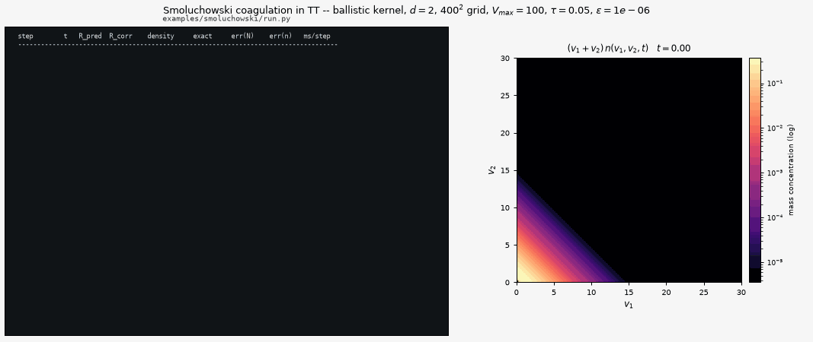

# Multicomponent Smoluchowski coagulation in the tensor-train format

[`examples/smoluchowski/run.py`](run.py) reproduces the reference experiment of Matveev–Zheltkov–Tyrtyshnikov–Smirnov ([JCP 2016](https://doi.org/10.1016/j.jcp.2016.04.025)) — the two-component Smoluchowski coagulation equation on a $1000^2$ grid — reaching the paper's error 2.2e-3 at TT rank 13, with the whole coagulation kept inside the tensor-train format.


## The problem

A population of particles carrying $d$ conserved components — the concentration $n(\bar v, t)$, $\bar v = (v_1,\dots,v_d)$ — coagulates pairwise at a rate $K$:

$$
\frac{\partial n(\bar v,t)}{\partial t}
= \frac12 \int_0^{v_1}\cdots\int_0^{v_d}
  K(\bar v - \bar u,\ \bar u)\ n(\bar v - \bar u)\ n(\bar u)\ d\bar u
\ -\ n(\bar v) \int_0^{\infty}\cdots\int_0^{\infty}
  K(\bar u,\ \bar v)\ n(\bar u)\ d\bar u
$$
The gain term counts the particles of size $\bar v$ assembled from $\bar u$ and $\bar v - \bar u$; the loss term counts the ones of size $\bar v$ eaten by anything. On a grid of $N$ nodes per component the gain term is a $2d$-fold sum: $O(N^{2d})$ per time step, $10^{12}$ operations at the modest $d=2$, $N=1000$ — the direct route the tensor-train scheme replaces.

## Two facts, composed

**The gain term is a lower-triangular convolution.** On a uniform grid it is a plain discrete convolution of zero-padded arrays, so the FFT does it in $O(N\log N)$ per axis. The trapezoidal quadrature weights are not in the way: halving the $v_k = 0$ slice of *both* factors turns the plain convolution into exactly the trapezoidal one, because the $\tfrac12$ endpoint weights of $\int_0^{v_k}$ land on $j = 0$ and $j = i$ by themselves. Written out for one axis,

$$
\tilde f_0 = \tfrac12 f_0,\quad \tilde g_0 = \tfrac12 g_0
\quad \Longrightarrow\quad 
(\tilde f * \tilde g)_i
= \tfrac12 f_i g_0 + \tfrac12 f_0 g_i + \sum_{j=1}^{i-1} f_{i-j} g_j
= \sum_{j=0}^{i} w_j^{(i)} f_{i-j} g_j ,
$$

which is the trapezoidal rule on $[0, v_i]$, exactly.

**Every step of that is a per-mode operation.** The FFT along mode $k$, the elementwise product, the truncation back to the first $N$ entries, the zeroing of the $v_k = 0$ slice — each one touches a single TT core and leaves the rest of the train alone. What is left is the elementwise product of two TT tensors, whose cores are the Kronecker products of the factors' cores over the rank indices. So the whole convolution never leaves the format:

```python
for k in range(d):
    a = f_cores[k].astype(complex);  a[:, 0, :] *= 0.5      # trapezoid
    b = g_cores[k].astype(complex);  b[:, 0, :] *= 0.5
    a = np.fft.fft(a, n=2 * nk, axis=1)                     # zero-pad + FFT
    b = np.fft.fft(b, n=2 * nk, axis=1)
    q = np.einsum("aib,cid->acibd", a, b).reshape(...)      # ranks multiply
    q = np.fft.ifft(q, axis=1) * h
    q = q[:, :nk, :];  q[:, 0, :] = 0.0                     # drop wrap-around
```

Cost: $O(d R^4 N \log N)$ — $2R^2$ forward transforms, $R^4$ inverse ones, one rounding of a rank-$R^2$ train. That is [`tt.algs.convolution.trapezoidal_convolution`](../../tt/algs/convolution.py), Algorithm 1 of the paper.

**The kernel has to be separable**, and enters as a list of rank-1 terms $K(\bar u;\bar v) = \sum_\alpha k^v_\alpha(\bar v) k^u_\alpha(\bar u)$. The gain then splits into one convolution per term, and — the part that is easy to miss — the loss term collapses from a $d$-fold integral *at every grid point* into one **scalar** quadrature per term:

$$
L_2(\bar v) = \sum_\alpha k^v_\alpha(\bar v) \int k^u_\alpha(\bar u)  n(\bar u)  d\bar u .
$$

Time stepping is the paper's eq. (5), the explicit midpoint predictor–corrector, second order. The log panel of the animation prints the TT rank after *both* stages, which is where the method's real cost lives: the predictor inflates the ranks (every Hadamard product multiplies them) and the rounding pulls them back.

## Oracle

For $K \equiv 1$ and $n_0 = ab e^{-a v_1 - b v_2}$ the paper's eq. (18) is exact:

$$
n(v_1,v_2,t) = \frac{ab e^{-a v_1 - b v_2}}{(1+t/2)^2}\quad 
I_0\left(2\sqrt{\frac{ab v_1 v_2 t}{t+2}}\right),
\qquad
N(t) = \int\int n = \frac{1}{1+t/2}\ \text{exactly.}
$$

Both are checked every step, and the totals are what the log's `density`/`exact` columns compare.

## What it reaches

Paper setup: $d=2$, $K\equiv 1$, $V_{\max} = 100$, $T = 10$, $a=b=1$, $\varepsilon = 10^{-6}$. Measured here (numpy backend, one core of an M-series laptop) against Table 1 of the paper:

| $N$ | $\tau$ | error, here | error, paper | rank, here | rank, paper | time, here |
|---|---|---|---|---|---|---|
| 100 | 0.1 | 6.3e-2 | 1.4e-1 | 11 | — | 0.4 s |
| 500 | 0.1 | 4.1e-3 | — | 13 | — | 2.1 s |
| 1000 | 0.1 | **2.24e-3** | 2.2e-3 | **13** | 13 | **4.5 s** |
| 2000 | 0.05 | 6.03e-4 | 5.0e-4 | 12 | — | 12.7 s |

The error column is the relative Frobenius distance to eq. (18) on the whole grid; the total density is an order more accurate again (1.8e-4 at $N = 1000$), because its leading quadrature errors cancel. The scheme's advertised $O(h^2 + \tau^2)$ is visible directly: halving $h$ and $\tau$ together on $V_{\max}=20$, $T=1$ divides the error by 3.69 and then 3.86. The error and the rank are the paper's own — the same scheme, the same grid, the same answer — reproduced with the whole tensor never leaving the TT format.

## Additive kernel

`--kernel additive` runs $K = \sum_i u_i + \sum_i v_i$ (rank 2). There is no analytic solution here, but there are two exact identities on the unbounded domain — the mass $\int (v_1+v_2) n$ is conserved and $N(t) = N_0 e^{-M_0 t}$ — and the script checks both. On the truncated box mass does leave through the top, which is the model, not a bug: at $V_{\max} = 40$, $T = 0.2$ the density falls by 33% while the mass drifts by 3.2e-3.

## Ballistic kernel: a separable form that is not written by hand

`--kernel ballistic` runs the paper's eq. (17),

$$
K(\bar u; \bar v) = \left(\Big(\textstyle\sum_i u_i\Big)^{1/3} + \Big(\textstyle\sum_i v_i\Big)^{1/3}\right)^{2}
\sqrt{\frac{1}{\sum_i u_i} + \frac{1}{\sum_i v_i}} ,
$$

the collision cross-section of two spheres times their relative thermal velocity. Nothing about it is separable in $\bar u$ and $\bar v$, so unlike the other two it cannot be written down as a short list of $(k^v, k^u)$ pairs. It is *constructed* instead, in two steps that are worth keeping apart because only the first one is approximate.

**Step 1 — cross, and it is the only error.** The $2d$-dimensional array $K[i_1..i_d, j_1..j_d]$ is built by `tt.algs.cross.cross` as a black box of the index: $O(d n r^2)$ entries are ever evaluated, never the $N^{2d}$ of them.

**Step 2 — cut the bond, and it is exact.** The mode order is *all $\bar u$ first, then all $\bar v$*, so exactly one TT bond separates the two groups. If its rank is $R$, slicing the two cores on either side of it by the bond index $\alpha$,

```python
ku_a = from_list(cores[:d-1] + [cores[d-1][:, :, a:a+1]])   # the u half
kv_a = from_list([cores[d][a:a+1, :, :]] + cores[d+1:])     # the v half
```

gives $\sum_\alpha k^u_\alpha(\bar u) k^v_\alpha(\bar v) = K(\bar u;\bar v)$ **identically**, entry by entry — it is a regrouping of the same TT contraction, not a second approximation. Measured on a dense $d=2$, $N=16$ case against the cross's own tensor: **3.2e-16**. All the error is the cross's, and `ballistic_kernel(..., info=d)` measures *that* on 4000 random nodes nobody looked at: at $\varepsilon = 10^{-6}$, **4.4e-7** relative and 4.5e-6 worst-case pointwise, against eq. (17) evaluated from the formula.

**Why $R$ is small, and why it does not grow with $N$.** $K$ is a function of two scalars, $K = F(S_u, S_v)$ with $S = \sum_i v_i$. The rank of the $\bar u | \bar v$ bond is therefore the $\varepsilon$-rank of the *two-variable* matrix $F(s,t)$ and of nothing else — a property of $F$, not of the grid, not of $V_{\max}$, and not of $d$. A dense SVD of $F$ sampled on the range of the sums puts that at **8** at $\varepsilon = 10^{-6}$, unchanged for $V_{\max}$ from 10 to 1000; the cross finds 6 or 7. The paper reports $R = 19..23$ (its Table 6) at the same accuracy.

Bond rank and build time against the grid ($d = 2$, $\varepsilon = 10^{-6}$):

| $N$ | 100 | 200 | 400 | 800 | 1600 | 3200 |
|---|---|---|---|---|---|---|
| $R$ | 6 | 7 | 7 | 7 | 7 | 7 |
| build | 0.2 s | 0.2 s | 1.0 s | 1.3 s | 4.0 s | 12.2 s |

…and against the number of components ($N = 100$), where the cross is over $2d$ modes and still does not care:

| $d$ | 2 | 3 | 4 | 5 |
|---|---|---|---|---|
| $R$ | 6 | 6 | 5 | 5 |
| build | 0.10 s | 0.21 s | 0.62 s | 0.56 s |

### The singularity, and the one modelling choice

$K$ is **infinite** when $\sum_i u_i = 0$ or $\sum_i v_i = 0$ — zero mass means zero volume and infinite thermal velocity — and the grid node $i = 0$ sits exactly on it. That is the model, not a bug, and something has to be done about it before a cross can approximate anything.

`ballistic_kernel` clips: $s_u = \max(\sum_i u_i, \texttt{floor})$, with `floor = h` by default — *a particle lighter than one grid node is treated as one grid node*, the smallest mass the grid can represent at all. The modification touches only the single hyperplane the grid cannot resolve anyway.

The paper does something else: it moves the grid off the singularity, starting the volume axis at $V_{\min} > 0$ and declaring the "full dissipation of sufficiently small particles" (its eq. (4)) — particles below the cutoff are *removed* from the system rather than clipped. The two are not the same physics: theirs deletes the mass below the cutoff, ours keeps it and understates its collision rate. The table below is where that difference is visible, and it is under 0.5% on the coarsest grid.

### Against Table 5 of the paper

Table 5 is the total density at $t = 1$ for $n_0 = e^{-v_1-v_2}$, $\tau = 0.05$. Nothing in the run knows these numbers:

| $N$ | $V_{\max}$ | paper | here | relative | kernel $R$ | solution rank | solver time here |
|---|---|---|---|---|---|---|---|
| 100 | 10 | 0.1847 | **0.1839** | 0.43% | 6 | 11 | 2.7 s |
| 200 | 20 | 0.1922 | **0.1917** | 0.26% | 7 | 13 | 10.3 s |
| 400 | 100 | 0.1943 | **0.1943** | 0.01% | 7 | 17 | 15.8 s |
| 800 | 200 | 0.1942 | **0.1943** | 0.05% | 7 | 17 | 37.1 s |
| 1600 | 200 | 0.1945 | **0.1945** | 0.00% | 7 | 17 | 68.2 s |
| 3200 | 200 | 0.1944 | **0.1946** | 0.10% | 7 | 19 | 173.2 s |

The paper's solution ranks are 12–18 across these rows (ours 11–19).

The two coarsest rows are where the clip and the paper's $V_{\min}$ disagree, and they disagree by less than the 5% by which the paper's own table moves between $N = 100$ and its converged value. From $N = 400$ on, the two constructions land on the same number to the last digit printed.



That is Fig. 2 of the paper, and the point of it is the comparison with the constant-kernel animation at the top of this page: the same grid, the same initial datum, the same horizon — but the constant kernel is still at $N(1) = 0.667$ of its start while the ballistic one is at 0.194, and its cloud has reached the edge of the window. "Much faster dynamics", as the paper puts it.

### The route not taken

Since $K = F(S_u, S_v)$, one can skip the $2d$-dimensional cross entirely: take the exact rank-2 `component_sum` for $S$, build a *matrix* skeleton $F \approx F(:,J) F(I,J)^{-1} F(I,:)$ on the range of the sums (the columns are then genuine scalar functions $F(\cdot, t_\beta)$, not tables), and lift each family into TT with one `multifuncrs` call over $S$. It works, and it gives the same physics — but measured against the plain cross it came out worse on rank and on kernel accuracy, so it is not what ships:

| at $N = 400$, $\varepsilon = 10^{-6}$ | $R$ | factor ranks | kernel error (Fro / max) | density |
|---|---|---|---|---|
| $2d$-cross + bond cut | **7** | 11 / 11 | **3.8e-7** / 3.5e-6 | 0.1943 |
| sum-skeleton + `multifuncrs` | 8 | 15 / 10 | 1.6e-6 / 1.3e-5 | 0.1943 |

The gap widens with $d$, because the skeleton route has to resolve $R$ functions jointly in one block-TT while the cross truncates the whole thing at once: at $d = 5$, $N = 100$ the cross reaches $R = 5$ with factor ranks 9, the skeleton $R = 8$ with factor ranks 14. The skeleton argument survives anyway — as the *explanation* of why $R \approx 8$, and as the independent oracle the rank test checks the cross against.

Other limits worth stating plainly: the scheme is second order and no better, so three digits in the profile need a fine grid rather than a tighter `eps`; the ranks are held down by rounding and by nothing else (no theorem promises they stay small — the printed rank is the only monitor); the grid must be uniform, because the FFT convolution *is* the uniform grid; and nothing enforces $n \ge 0$.

## Running it

```
python examples/smoluchowski/run.py                          # the table row above
python examples/smoluchowski/run.py --N 2000 --tau 0.05      # the next one
python examples/smoluchowski/run.py --kernel additive --T 0.3 --tau 0.01
python examples/smoluchowski/run.py --gif docs/media/smoluchowski_run.gif

# the ballistic kernel, on the rows of the paper's Table 5
python examples/smoluchowski/run.py --kernel ballistic --N 100 --vmax 10 --T 1 --tau 0.05
python examples/smoluchowski/run.py --kernel ballistic --N 400 --vmax 100 --T 1 --tau 0.05
python examples/smoluchowski/run.py --kernel ballistic --N 400 --vmax 100 --T 1 --tau 0.05 \
    --view 30 --gif docs/media/smoluchowski_ballistic.gif
```

The acceptance versions of both oracles live in `tests/test_examples.py`; the algorithm itself is pinned in `tests/test_convolution_and_coagulation.py`, including the convolution against a brute-force dense quadrature written from the definition (agreement 1.1e-15).

## Layout

This example is a directory, not a single file, because the model is not a
tensor-train primitive and does not belong in the package:

* `solver.py` — the coagulation model: separable kernels (including the
  cross-built `ballistic_kernel`), the coalescence right-hand side, the
  predictor-corrector step, the time loop;
* `run.py` — the command line, the diagnostics and the animation;
* the one reusable piece, the lower-triangular trapezoidal convolution, *is*
  in the package as `tt.algs.convolution.trapezoidal_convolution` — a
  Volterra convolution on a uniform grid is a general tool, coagulation is
  an application of it.

